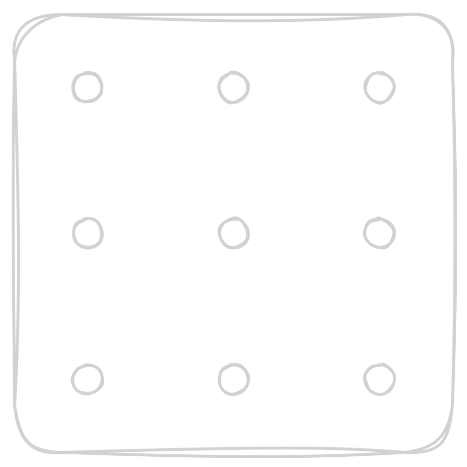
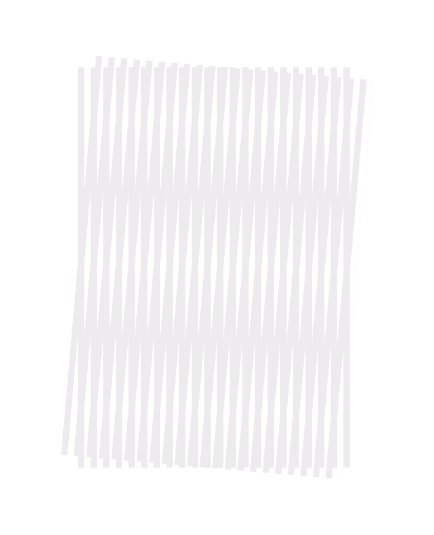
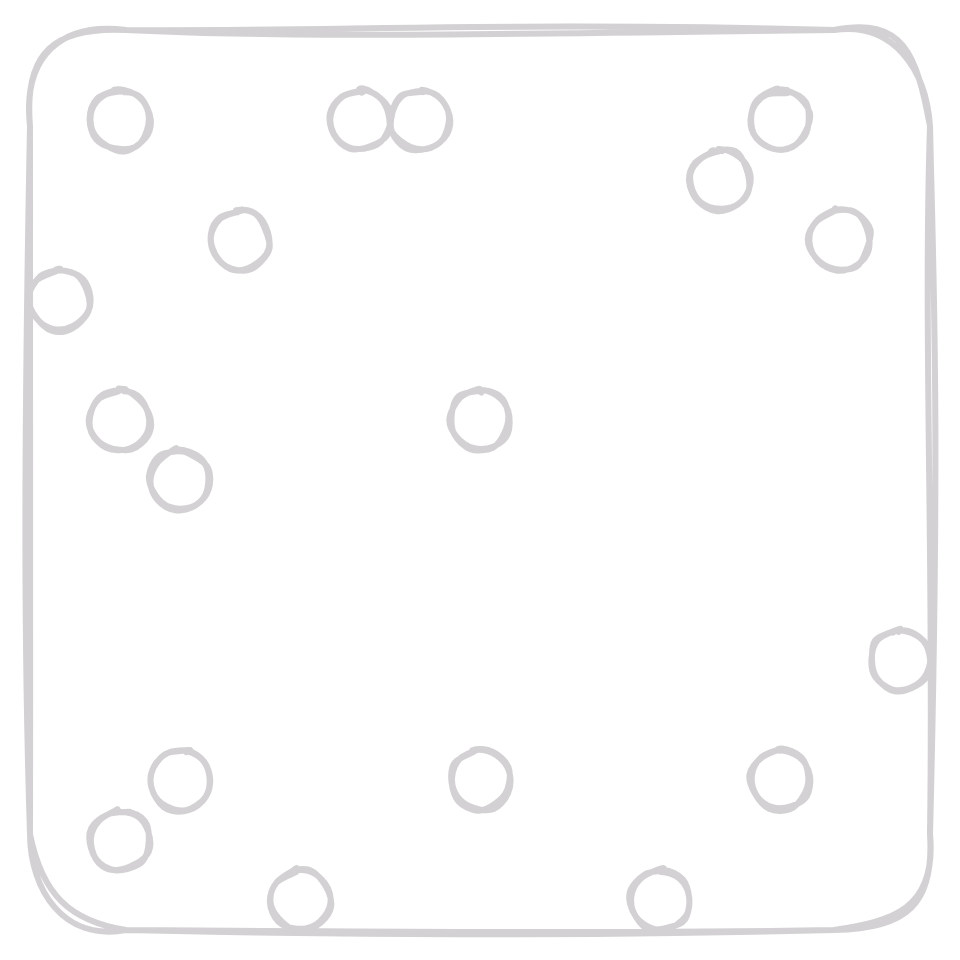
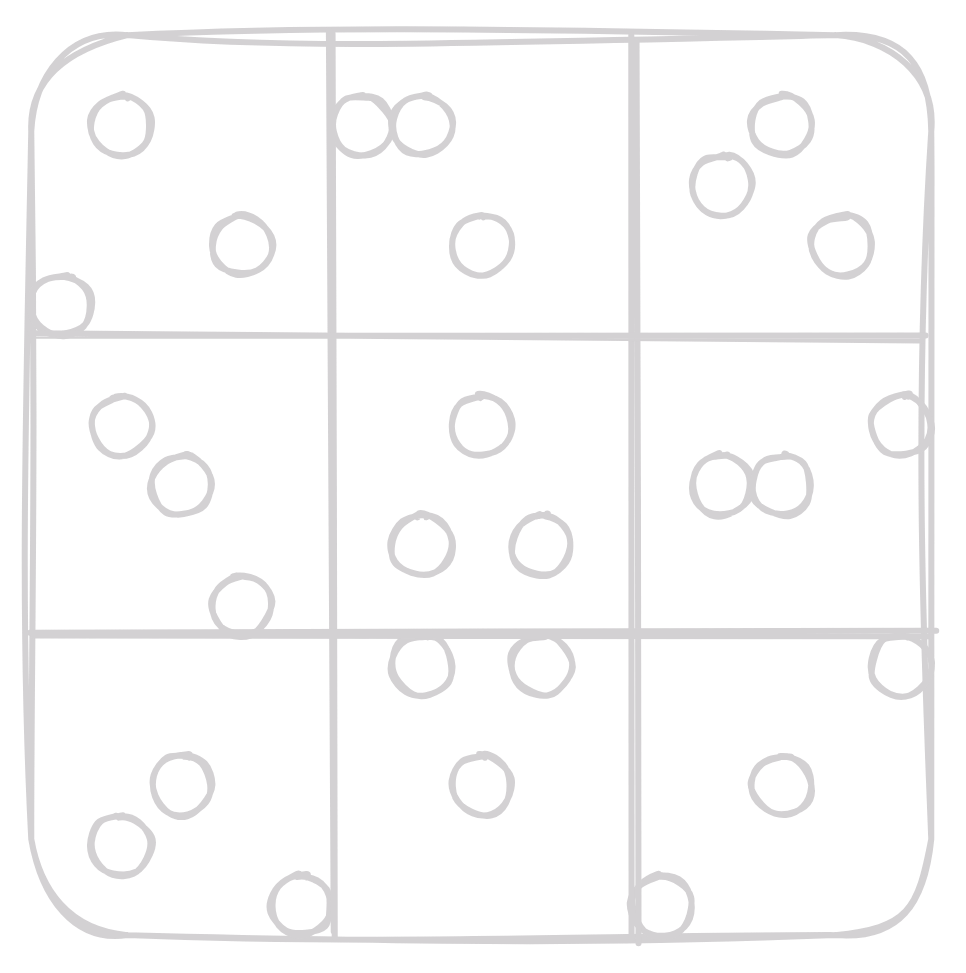
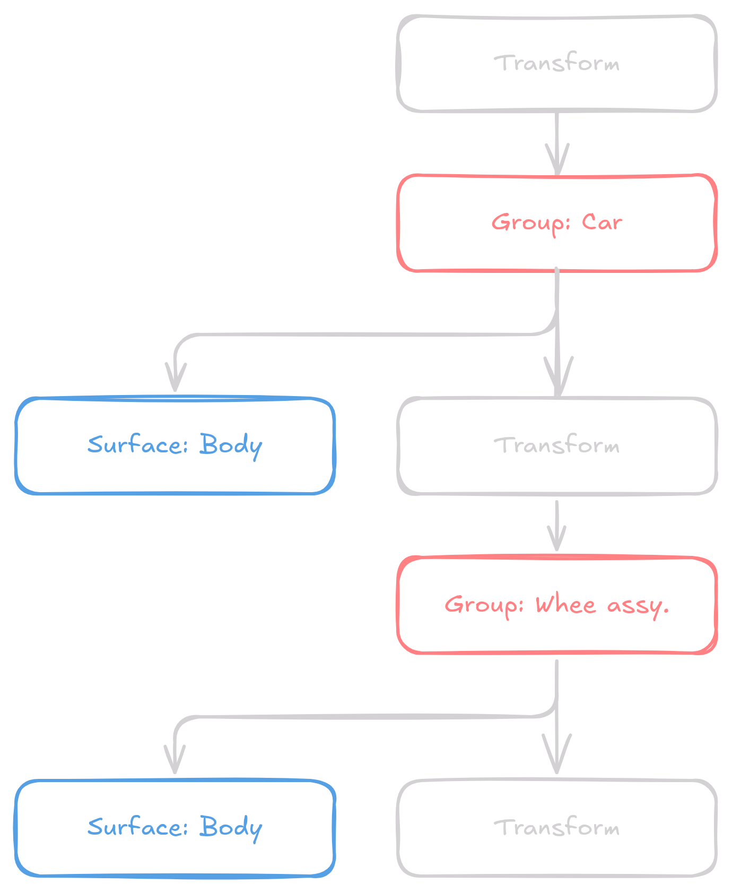
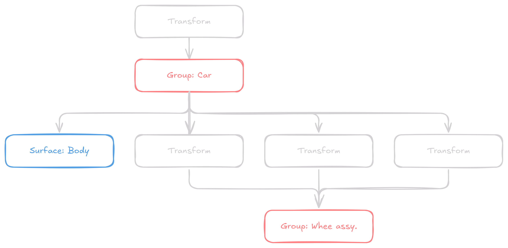
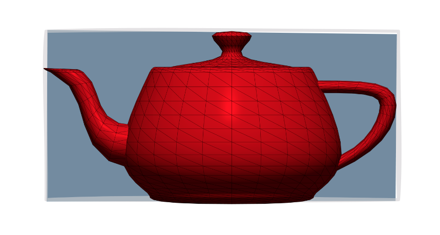
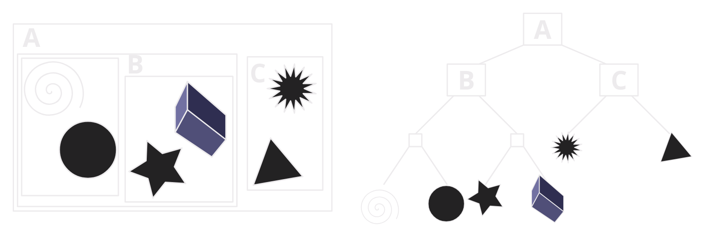
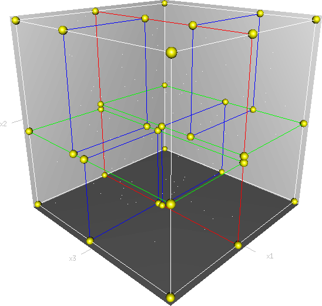

## Antialiasing

Antialiasing is a technique used to reduce the appearance of jagged edges in images. It is particularly useful in ray tracing, where the jagged edges are caused by the discrete nature of the pixels in the image. Simple way to antialias an image is to average color in a small neighborhood around each pixel. 

### Regular Sampling

Sub-sample a pixel in regular grid fashion by shooting out rays passing through sub-pixels sampled regularly

Replace 
```python
for each pixel (i, j) in the image:
    c_ij = ray_color(i + 0.5, j + 0.5)
```
By
```python
for each pixel (i, j) in the image:
    c_ij = 0
    for (p,q) in (0, n-1) x (0, n-1):
        c_ij += ray_color(i + (p + 0.5) / n, j + (q + 0.5) / n)

    c_ij /= n^2
```

Where `n` is the number of sub-pixels in the pixel.


<figure markdown="span">
    { width="200" }
  <figcaption>Regular Sampling</figcaption>
</figure>

!!! danger "Drawback"
    Regular sampling can cause Moire pattern in the image. Moire patterns happen when two sets of lines or grids overlap and make a new, wavy or swirly pattern.

    <figure markdown="span">
        { width="200" }
      <figcaption>Moire Pattern</figcaption>

### Random Sampling

Choosing sub-pixels randomly instead of regular grid. Select n^2 random points in the pixel and average the color of the rays passing through them. 

```python
for each pixel (i, j) in the image:
    c_ij = 0
    for k in 1 to n^2:
        p = random()
        q = random()
        c_ij += ray_color(i + p, j + q)

    c_ij /= n^2
```

Where `random()` returns a random number between 0 and 1.


<figure markdown="span">
    { width="200" }
  <figcaption>Random Sampling</figcaption>
</figure>

!!! danger "Drawback"
    Random sampling can cause noise in the image. Noise is the random variation of brightness or color in an image.

### Jittered Sampling

Jittered sampling is a compromise between regular and random sampling. It is a form of random sampling where the random points are chosen in a regular grid but with some random offset. 

```python
for each pixel (i, j) in the image:
    c_ij = 0
    for (p,q) in (0, n-1) x (0, n-1):
        p += random()
        q += random()
        c_ij += ray_color(i + (p + 0.5) / n, j + (q + 0.5) / n)

    c_ij /= n^2
```

<figure markdown="span">
    { width="200" }
  <figcaption>Jittered Sampling</figcaption>
</figure>

!!! note "Poisson Disk Sampling"
    Poisson Disk Sampling is a more advanced sampling technique that ensures that no two samples are too close to each other by ensuring distance between all samples is at least $r$. This helps in reducing noise in the image while maintaining the randomness of the samples.

## Transformations in Ray Tracing

Either transform object to world coordinates or transform ray to world coordinates.

Create a wrapper class `TransformedSurface` that takes a surface and a transformation matrix and transforms the ray to world coordinates before intersecting with the surface.

```cpp
class TransformedSurface : public Surface

private:
    Surface* surface;
    Matrix4x4 transform;

public:
    bool intersect(const Ray& ray);
```

To intersect the ray with the transformed surface, transform the ray to world coordinates, intersect with the surface, and then transform the hit point back to object coordinates.

```cpp
bool TransformedSurface::intersect(const Ray& ray) {
    Ray transformed_ray = ray.transform(transform.inverse());
    transformed_hit = surface->intersect(transformed_ray);
    return transformed_hit.transform(transform);
}
```

### Groups and Hierarchies

Often it's useful to group surfaces together to apply transformations to all of them at once. This can be done by creating a `SurfaceGroup` class that contains a list of surfaces and a transformation matrix, which returns the closest surface hit by the ray.

```cpp
class SurfaceGroup : public Surface

private:
    std::vector<Surface*> surfaces;
    Matrix4x4 transform;

public:
    bool intersect(const Ray& ray);
```

A common optimization is to merge transforms with Groups

<figure markdown="span">
    { width="400" }
  <figcaption>Transformations in Ray Tracing</figcaption>
</figure>

#### Instancing

- Transform objects in several ways
- One surface could have multiple `TransformedSurface` instances with different transformations
- Allowing this makes the transformation tree a DAG (Directed Acyclic Graph)

<figure markdown="span">
    { width="800" }
  <figcaption>Instancing</figcaption>
</figure>

### Some more considerations
Transforming rays is expensive

- minimize tree depth
    - push all transformations towards the leaves
    - merge transformations
- internal group nodes still required for instancing
    - can't push two transforms down to same child

## Ray Tracing Acceleration

Most of the time is spent in ray-surface intersection tests
Was to reduce reduce this time :-

- Make intersection tests faster, but this is hard and can only go so far
- Reduce the number of intersection tests
    - Intersection with every object is not necessary
    - Basic strategy: efficiently find big chunks of geometry that can be skipped

### Bounding Volumes (bvol)

Bounding volumes are simple shapes that enclose a more complex shape. They are used to quickly determine if a ray intersects a complex shape by first checking if it intersects the bounding volume.

- If the ray doesn't intersect the bounding volume, it can't intersect the complex shape
- If the ray intersects the bounding volume, then check the complex shape

Some more considerations

- Cost of bvol intersection test should be low. Therefore, use simple shapes like spheres, boxes, etc.
- Cost of object intersection test should be high. Therefore, bvol is most useful when the object is complex.
- Tightness of bvol is important. A tight bvol will reduce the number of intersection tests.

<figure markdown="span">
    { width="400" }
  <figcaption>Bounding Volume</figcaption>
</figure>


#### Choice of Bounding Volume
- Sphere: Easy to intersect, but not tight
- Axis-aligned bounding box (AABB): Easy to intersect, tight, especially for axis-aligned objects
- Oriented bounding box (OBB): Easy to intersect, but cost of transformation, tighter for arbitrary objects

Computing the bvol

- For simple shapes like spheres and AABBs, it's easy to compute the bounding volume
- For groups: not so easy for OBBs
- For transformed objects: not so easy for spheres

#### Implementation

Using a new Surface subclass `BoundedSurface` that contains a bounding volume and a surface. The `BoundedSurface` class first checks if the ray intersects the bounding volume and then checks if the ray intersects the surface.

```cpp
class BoundedSurface : public Surface

private:
    Surface* surface;
    BoundingVolume* bvol;

public:
    bool intersect(const Ray& ray);
```

```cpp

bool BoundedSurface::intersect(const Ray& ray) {
    if (!bvol->intersect(ray)) {
        return false;
    }

    return surface->intersect(ray);
}
```

### Bounding Volume Hierarchies (BVH)

Using a hierarchy of bounding volumes to reduce the number of intersection tests. The bounding volume hierarchy is a tree where each node contains a bounding volume that encloses all the objects in its children.

<figure markdown="span">
    { width="800" }
  <figcaption>Bounding Volume Hierarchy</figcaption>
</figure>

#### Building the BVH

Done in a top-down fashion, making a bbox that encloses all objects and then splitting it into two smaller boxes. This is done recursively until each box contains a small number of objects.

How to partition the objects?

- Ideal: Clusters
- Practical: Splitting the bounding box along the longest axis
    - **Center Partition** - Efficient, but can be unbalanced
    - **Median Partition** - Balanced, but more expensive
    - **SAH (Surface Area Heuristic)** - Model expected cost of ray intersection, produces best performance


### Space Subdivision

Instead of partitioning objects, we partition space instead. We can do partitioning in a regular fashion (grid) or in a non-regular fashion (octree, kd-tree).

Regular Grid division simply divides space into a grid and assigns objects to the grid cells. This is simple and easy to implement, but can be inefficient if objects are not uniformly distributed.


### Non-Regular Space Subdivision

- kd-tree: subdivides space, like a grid, but it is adaptive like BVH

<figure markdown="span">
    { width="400" }
  <figcaption>kd-tree</figcaption>