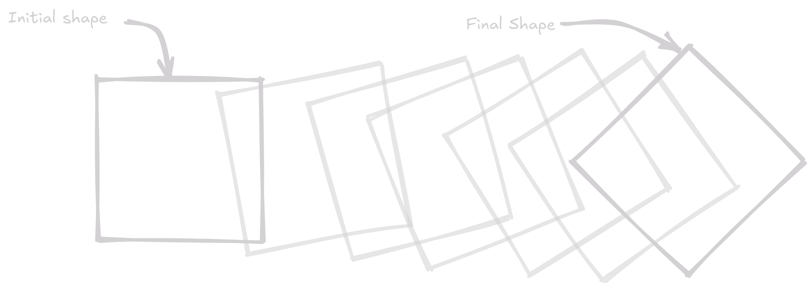

Animation is specifying shape as a function a time, but we don't want to specify the shape of the object at every point in time. Instead, we want to specify the shape of the object at a few keyframes, and let the computer interpolate the shape of the object between the keyframes. This is called keyframe animation, i.e. draw important poses first, and let the computer fill in the rest.

Thus, we can divide the animation process into two steps:

- Creating high-level controls for adjusting geometry
- Interpolate these controls over time between keyframes

## Affine Transformations

!!! abstract "Recap"
    Affine transformations are rotations, translations, and scaling. They are linear transformations that preserve points, straight lines, and planes. They are represented by a 4x4 matrix.

Transformations in animation can be of two types:

- Global or Affine Transformations
- Local, which are hierarchy of affine, or point-wise affine transformations

If we naively interpolate between two affine transformations, we might not get the desired result. Consider the following example:

We have a square that we want to turn by 45 degrees, something like the following:

<figure markdown="span">
    { width=800 }
    <figcaption> Linearly Interpolating Transformations</figcaption>
</figure>

Where let $\mathbf{M}_0 = I$ and $\mathbf{M}_1 = R$, where $R$ is rotation by angle $\theta$ Then the linearly interpolated transformation $\mathbf{M}_t$ is:

$$
\begin{align*}
\mathbf{M}_t &= I + t(R - I) \\
&= \begin{bmatrix} 1 & 0 \\ 0 & 1 \end{bmatrix} + t \left( \begin{bmatrix} \cos \theta & -\sin \theta \\ \sin \theta & \cos \theta \end{bmatrix} - \begin{bmatrix} 1 & 0 \\ 0 & 1 \end{bmatrix} \right) \\
&= \begin{bmatrix} 1 + t(\cos \theta - 1) & -t \sin \theta \\ t \sin \theta & 1 + t(\cos \theta - 1) \end{bmatrix}
\end{align*}
$$

This should be a valid rotation matrix, but it is not. Any valid rotation matrix must have the following 3 properties

- Rows must be orthogonal
- Columns must be orthogonal
- Determinant must be +1

Let's verify each of these properties for $\mathbf{M}_t$:

- Row orthogonality: $(1 + t(\cos \theta - 1))(t \sin \theta) + (-t \sin \theta) \cdot (1 + t(\cos \theta - 1))  = 0$
- Column orthogonality: $(1 + t(\cos \theta - 1))(t \sin \theta) + (-t \sin \theta) \cdot (1 + t(\cos \theta - 1))  = 0$
- Determinant:

$$
\begin{align*}
\text{det}(\mathbf{M}_t) &= (1 + t(\cos \theta - 1))^2 + t^2 \sin^2 \theta \\
&= 1 + 2t(\cos \theta - 1) + t^2(\cos^2 \theta - 2 \cos \theta + 1) + t^2 \sin^2 \theta \\
&= 1 + 2t(\cos \theta - 1) + t^2(\cos^2 \theta + \sin^2 \theta - 2 \cos \theta + 1) \\
&= 1 + 2t(\cos \theta - 1) + t^2(2 - 2 \cos \theta) \\
&= 1 + 2t(\cos \theta - 1) + 2t^2(1 - \cos \theta) \\
\end{align*}
$$

For $\text{det}(\mathbf{M}_t) = 1$, we need $2t(\cos \theta - 1) + 2t^2(1 - \cos \theta) = 0$ 

$$2t(\cos \theta - 1) + 2t^2(1 - \cos \theta) = (1 - \cos \theta) 2t(t - 1) = 0$$

i.e. $t = 0$ or $t = 1$. This means that the linearly interpolated transformation is not a valid rotation matrix for any $t \neq 0, 1$.

### Then how to correctly interpolate transformations?

$\mathbf{M}$ is a function of $\theta, t, s$ for rotation, translation, and scaling respectively. We can interpolate these parameters linearly and then construct the transformation matrix. 
