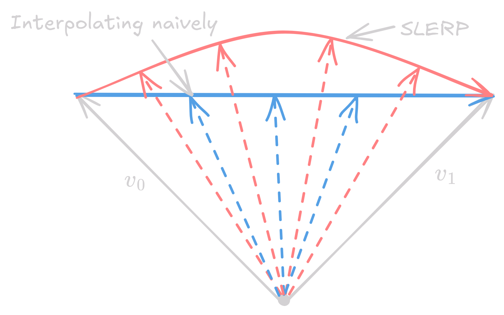
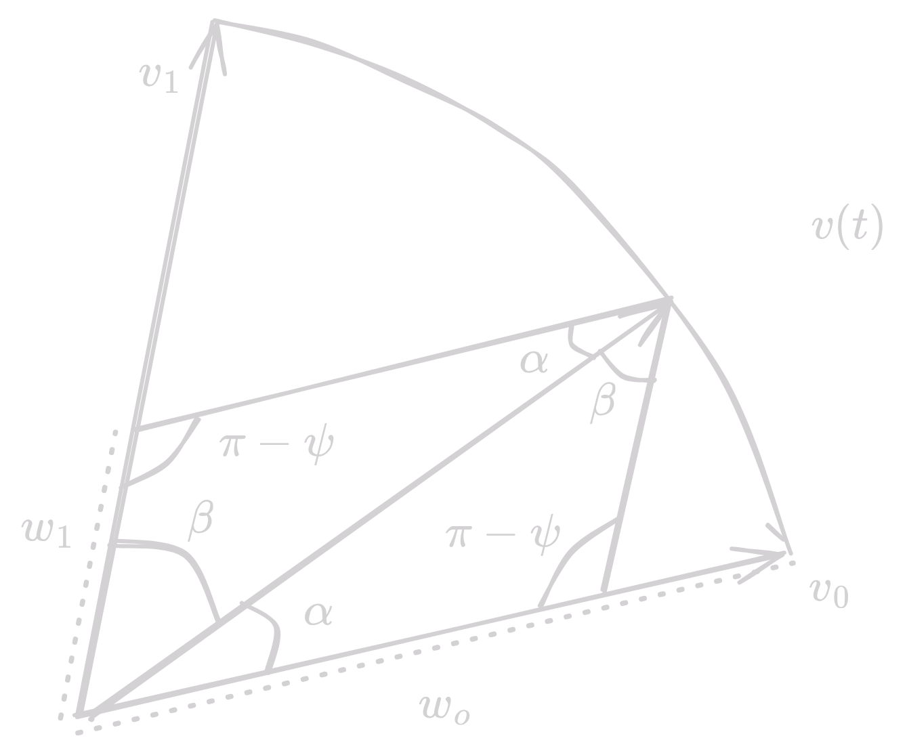

Animation is specifying shape as a function a time, but we don't want to specify the shape of the object at every point in time. Instead, we want to specify the shape of the object at a few keyframes, and let the computer interpolate the shape of the object between the keyframes. This is called keyframe animation, i.e. draw important poses first, and let the computer fill in the rest.

Thus, we can divide the animation process into two steps:

- Creating high-level controls for adjusting geometry
- Interpolate these controls over time between keyframes

## Affine Transformations

!!! abstract "Recap"
    Affine transformations are rotations, translations, and scaling. They are linear transformations that preserve points, straight lines, and planes. They are represented by a 4x4 matrix.

Transformations in animation can be of two types:

- Global or Affine Transformations
- Local, which are hierarchy of affine, or point-wise affine transformations

If we naively interpolate between two affine transformations, we might not get the desired result. Consider the following example:

We have a square that we want to turn by 45 degrees, something like the following:

<figure markdown="span">
    { width=800 }
    <figcaption> Linearly Interpolating Transformations</figcaption>
</figure>

Where let $\mathbf{M}_0 = I$ and $\mathbf{M}_1 = R$, where $R$ is rotation by angle $\theta$ Then the linearly interpolated transformation $\mathbf{M}_t$ is:

$$
\begin{align*}
\mathbf{M}_t &= I + t(R - I) \\
&= \begin{bmatrix} 1 & 0 \\ 0 & 1 \end{bmatrix} + t \left( \begin{bmatrix} \cos \theta & -\sin \theta \\ \sin \theta & \cos \theta \end{bmatrix} - \begin{bmatrix} 1 & 0 \\ 0 & 1 \end{bmatrix} \right) \\
&= \begin{bmatrix} 1 + t(\cos \theta - 1) & -t \sin \theta \\ t \sin \theta & 1 + t(\cos \theta - 1) \end{bmatrix}
\end{align*}
$$

This should be a valid rotation matrix, but it is not. Any valid rotation matrix must have the following 3 properties

- Rows must be orthogonal
- Columns must be orthogonal
- Determinant must be +1

Let's verify each of these properties for $\mathbf{M}_t$:

- Row orthogonality: $(1 + t(\cos \theta - 1))(t \sin \theta) + (-t \sin \theta) \cdot (1 + t(\cos \theta - 1))  = 0$
- Column orthogonality: $(1 + t(\cos \theta - 1))(t \sin \theta) + (-t \sin \theta) \cdot (1 + t(\cos \theta - 1))  = 0$
- Determinant:

$$
\begin{align*}
\text{det}(\mathbf{M}_t) &= (1 + t(\cos \theta - 1))^2 + t^2 \sin^2 \theta \\
&= 1 + 2t(\cos \theta - 1) + t^2(\cos^2 \theta - 2 \cos \theta + 1) + t^2 \sin^2 \theta \\
&= 1 + 2t(\cos \theta - 1) + t^2(\cos^2 \theta + \sin^2 \theta - 2 \cos \theta + 1) \\
&= 1 + 2t(\cos \theta - 1) + t^2(2 - 2 \cos \theta) \\
&= 1 + 2t(\cos \theta - 1) + 2t^2(1 - \cos \theta) \\
\end{align*}
$$

For $\text{det}(\mathbf{M}_t) = 1$, we need $2t(\cos \theta - 1) + 2t^2(1 - \cos \theta) = 0$ 

$$2t(\cos \theta - 1) + 2t^2(1 - \cos \theta) = (1 - \cos \theta) 2t(t - 1) = 0$$

i.e. $t = 0$ or $t = 1$. This means that the linearly interpolated transformation is not a valid rotation matrix for any $t \neq 0, 1$.

### Then how to correctly interpolate transformations?

$\mathbf{M}$ is a function of $\theta, t, s$ for rotation, translation, and scaling respectively. We can interpolate these parameters linearly and then construct the transformation matrix. 

---

Rotations in 3D belong to a group called $SO(3)$, which stands for Special Orthogonal group in 3D. Special as $\det{R} = 1$ and Orthogonal as $R^T R = I$. 

## Spherical Linear Interpolation (SLERP)

Say we want to interpolate from vector $\mathbf{v}_0$ to $\mathbf{v}_1$. We can't just interpolate the vectors directly, as the interpolated vector might not be a unit vector. The vector connecting the vector is 

$$w = \hat{v_1} + (\hat{v_0} \cdot \hat{v_1}) \hat{v_0}$$

Angle between the vectors is $\theta = \cos^{-1}(\hat{v_0} \cdot \hat{v_1})$. We can interpolate the angle and then construct the vector.

$$\hat{v(t)} = (\cos t\theta) \hat{v_0} + (\sin t\theta) \hat{w} \quad \text{where } t \in [0, 1]$$

<figure markdown="span">
    { width=400 }
    <figcaption> Spherical Linear Interpolation</figcaption>
</figure>

---

There are various ways of parameterizing rotations, but each of them have their own pros and cons. Below we discuss 3 ways of parameterizing rotations:

- Euler Angles
- Axis-Angle
- Quaternions

## Euler Angles

- Rotate around x-axis , then y-axis, then z-axis. Do note that these axis are in the object's local coordinate system, and not in global coordinate system.
- Memory efficient and simple to understand

$$f(\alpha, \beta, \gamma) = R_z(\gamma) R_y(\beta) R_x(\alpha)$$

The problem with Euler angles is gimble lock, where two axes align and the third axis is lost.

## Axis-Angle

- Specify axis to rotate around, and angle by which to rotate
- Multiply axis and angle to get a more compact form 

$$f(\mathbf{a}, \theta) = R_{\hat{a}}(||\mathbf{a}||)$$

Problem with Axis-angle is with separate rotation angle, there are mutliple ways to represent the same rotation.

Even with combined rotation angle, making small changes near 180$^\circ$ can lead to large changes in the rotation.

## Quaternions

A quaternion is an extension of complex numbers

$$q = (s, v) = (s, v_1, v_2, v_3)$$

We partition $\sqrt{-1}$ as $i, j, k$ and then define multiplication as:

$$i^2 = j^2 = k^2 = ijk = -1$$

They have a cyclic relationship with multiplication i.e.

$$ij = k, jk = i, ki = j \text{ and } ji = -k, kj = -i, ik = -j$$

Hence, we define the set of quaternion as:

$$\mathbb{H} = \{a + bi + cj + dk | (a, b, c, d) \in \mathbb{R}^4\}$$

### Properties of Quaternions

| Property | Description |
| --- | --- |
| Conjugate | $\bar{q} = (s, -v) = a - bi - cj - dk$ |
| Norm | $\|q\| = \sqrt{q \bar{q}} = \sqrt{a^2 + b^2 + c^2 + d^2}$ |
| Associative | $q_1(q_2q_3) = q_1q_2q_3 = (q_1q_2)q_3$ |
| Not Commutative | $q_1q_2 \neq q_2q_1$ |
| Multiplication of Magnitudes | $\|q_1q_2\| = \|q_1\| \|q_2\|$ |

For unit quaternions, $\|q\| = 1$, $\bar{q} = q^{-1}$

### Unit Quaternions

The set of unit-magnitude quaternions is denoted as $S^3$. They are used to represent rotations in 3D space.

- $|q_1| = |q_2| = 1 \implies |q_1q_2| = 1$
- $q_1, q_2 \in S^3 \implies q_1q_2 \in S^3$

### Scalar Vector Representation

$$q = (s, v) = (s, v_1, v_2, v_3) = s + v_1i + v_2j + v_3k$$

Multiplication of two quaternions is then:

$$(s_1, v_1)(s_2, v_2) = (s_1s_2 - v_1 \cdot v_2, s_1v_2 + s_2v_1 + v_1 \times v_2)$$

For unit quaternions, $|s|^2 + |v|^2 = 1$, so we can think of these as sine ans cosine of and angle $\psi$, so $q = (\cos \psi, \mathbf{\hat{v}} \sin \psi )$ or $q = \cos \psi + \mathbf{\hat{v}} \sin \psi$ (similar to how we write complex numbers)

### Quaternions and Rotations

There is a natural association between the unit quaternion and the 3D axis-angle rotation. If $cos \psi + \mathbf{\hat{v}} \sin \psi \in S^3$, and $R_{\hat{v}}(\theta)$ is the rotation matrix, then: $\theta = 2\psi$

Represent a point in space by a purely-imaginary quaternion

$$\mathbf{x} = (x, y, z) \in \mathbb{R}^3 \leftrightarrow X = xi + yj+ zk \in \mathbb{H}$$

Then, we can compute rotations by quaternion $q$ as:

$$X_{\text{rot}} = qX\bar{q}$$

And we can do multiple rotations by as well as 

$$q_1(q_2X\bar{q_2})\bar{q_1} = (q_1q_2)X\bar{q_2}\bar{q_1} = (q_1q_2)X\overline{q_1q_2}$$

If we write a unit quaternion as $q = \cos \psi + \mathbf{\hat{v}} \sin \psi$, then operation:

$$X_{\text{rot}} = qX\bar{q} = (\cos \psi + \mathbf{\hat{v}} \sin \psi) X (\cos \psi - \mathbf{\hat{v}} \sin \psi)$$

This is equivalent to rotating the point by angle $2\psi$ around axis $\mathbf{\hat{v}}$, so an alternate explanation is "A quaternion is just a slightly different way to encode an axis and angle in 4 numbers, than than a number $\theta$ and a vector $\mathbf{v}$, we store the number $\cos \frac{\theta}{2}$ and the vector $\sin \frac{\theta}{2} \mathbf{v}$"

--- 

But why quaternions?

- Fast, fewer operations
- Numerically stable for incremental changes
- Composes rotations nicely
- Convert to matrices at the end
- Biggest reason is spherical linear interpolation (SLERP)

### SLERP using Quaternions

<figure markdown="span">
    { width=400 }
    <figcaption> Spherical Linear Interpolation using Quaternions</figcaption>
</figure>

From here, $\alpha + \beta = \psi$, and $v(t) = w_0 v_0 + w_1 v_1$

$$\frac{\sin \alpha}{w_1} = \frac{\sin \beta}{w_0} = \frac{\sin (\pi - \psi)}{1} = \sin \psi$$

From here, we get $w_ = \frac{\sin \beta}{\sin \psi}$ and $w_1 = \frac{\sin \alpha}{\sin \psi}$ and $\psi = \cos^{-1}(v_0 \cdot v_1)$

Therefore, finally we can write the SLERP as:

$$
\begin{align*}
v(t) &= \frac{\sin \beta}{\sin \psi} v_0 + \frac{\sin \alpha}{\sin \psi} v_1 \\
&= \frac{\sin(\psi - \alpha) v_0 + \sin(\alpha) v_1}{\sin \psi} \\
&= \frac{\sin((1-t)\psi) v_0 + \sin(t\psi) v_1}{\sin \psi} & \text{where } \alpha = t \psi, t \in [0, 1]
\end{align*}
$$

---

When angle gets close to zero, estimation of $\psi$ is inaccurate. For small angles, use linear interpolation instead. If $q_0 q_1 > 0$, then slerp between then, else slerp between $q_0$ and $-q_1$

## Animation Handles

We design objects using a hierarchy of handles which have predefined degrees of freedom.
Animation handles are high-level controls that allow us to adjust the geometry of the object. They are used to specify the shape of the object at keyframes.

The main handle types are 

- Point Handle
- Line handles or skeleton handles
- Cage handles

## Kinematics and Inverse Kinematics

Relationship between DOFs and 3D pose is called kinematics. ==A kinematic chain is a sequence of rigid bodies connected by joints==. There are mainly 3 parts when talking about kinematics

- Root: The first body in the chain
- End Effector: The last body in the chain
- Joints: The connections between the bodies

Forward Kinematics deals with finding the pose of the end effector given the joint angles. Inverse Kinematics deals with finding the joint angles given the pose of the end effector.

## Surface Deformation Techniques

### Mesh Skinning

Mesh skinning is a simple way to deform a surface to follow a skeleton. Let's assume surface as control points $p_i$, and each bone has a transformation matrix $M_j$ (normally a rigid motion), and every point-bone pair has a weight $w_{ij}$.

Then the deformed point $p_i'$ is a weighted sum of the transformations of the bones:

$$p_i' = \sum_{j} w_{ij} M_j p_i$$

This method is also called linear blend skinning. This is a simple and fast method, but it has some issues: 

- Surface collapses on the inside of bends and in presence of strong twists. A fix for this is using dual-quaternion skinning instead.

### Blend Shapes

We just provide a few key poses and interpolate between them. User provides all the key shapes, i.e. a position for every control point in every shape $p_{ij}$, for point $i$ in shape $j$, and also a weight $w_j$ for each shape. It's essential that $\sum_j w_j = 1$ for every frame

Then the deformed point $p_i'$ is:

$$p_i' = \sum_j w_j p_{ij}$$

This works well for relatively small motions, like faces.

!!! note
    Some topics are not covered here like Motion Capture. Interested readers can find more about them online, in the slides or in the book.

