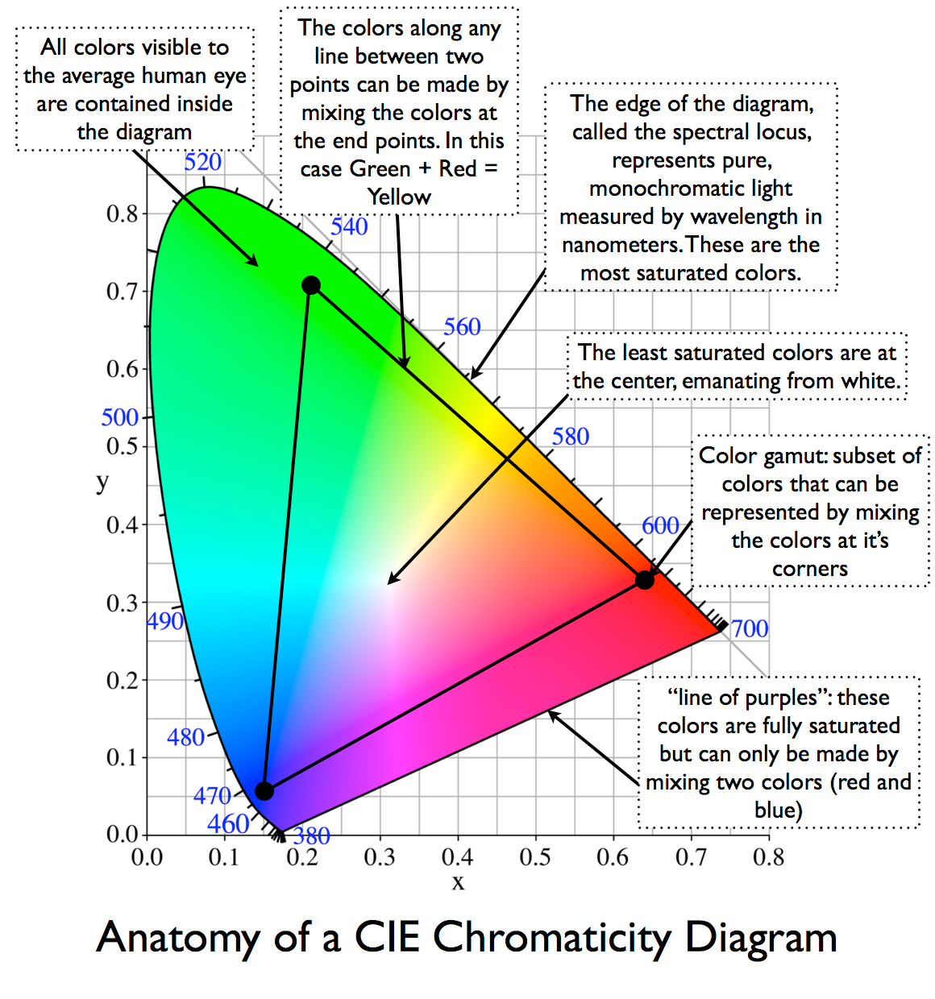

## Measuring Light
- Colorimetry is the science of measuring light and color.
- Sensations that arise from light energy of different wavelengths
- Color is a phenomenon of human perception and not a universal property of light
- The photodetectors in human retina consists of rods and cones
    - Rods : Sensitive to brightness
    - Cones : Sensitive to color 

### Cone Responses 
- Three types of cones in human retina
    - S-cones : Sensitive to short wavelengths
    - M-cones : Sensitive to medium wavelengths
    - L-cones : Sensitive to long wavelengths
- Response of a cone is magnitude of electrical signal generated in response to light of a particular wavelength. $\phi(\lambda)$ is the wavelength density function of the incident light, and $L(\lambda)$, $M(\lambda)$, and $S(\lambda)$ are the response functions of the L, M, and S cones, respectively. The response of the cones can be expressed as:

$$ L = \int_{\lambda} \phi(\lambda) L(\lambda) d\lambda $$

$$ M = \int_{\lambda} \phi(\lambda) M(\lambda) d\lambda $$

$$ S = \int_{\lambda} \phi(\lambda) S(\lambda) d\lambda $$

### Colorometric Concepts
- **Luminance** : Brightness of a color
- **Chromaticity** : Color without brightness
- **Dominant Wavelegth** : Single spectral color (hue)
- **Purity** : Ratio of pure color to white light (saturation)
  
## Color matching

Photoreceptors act as linear intergrators of light energy. This means it's possible to find two different spectral distributions $-\phi_1(\lambda)$ and  $-\phi_2(\lambda)$ that produce the same response in the cones. This is the basis of color matching. This is called metamerism. 

- Spectral tri-stimulus values - using monochromatic light sources to match a given color
- CIE defined three primaries: 435.8 nm(B), 546.1 nm(G) and 700.0 nm(R)
- A color can be matched by a linear combination of the three primaries
- Negative values means that wavelength is too saturated to be produced by the primary

It's possible to transform one set of tristimulus values to another

- CIE defined a standard observer with color matching functions $X(\lambda)$, $Y(\lambda)$, and $Z(\lambda)$
- Cannot be realized physically

### Color spaces
- We could define an orthogonal coordinate system with $X$, $Y$, and $Z$ as the axes
- Color gamut: spacial extent of volume in which colors lie

$$ x = \frac{X}{X+Y+Z} \hspace{1cm} y = \frac{Y}{X+Y+Z} \hspace{1cm} z = \frac{Z}{X+Y+Z} $$

$$ X = \frac{x}{y} Y \hspace{1cm} Z = \frac{1-x-y}{y} Y $$

We usually represent Z in terms of X and Y, and Y is the luminance.

### Chromaticity Diagram

<figure markdown="span" >
    { width="600" }
  <figcaption>Chromaticity Diagram</figcaption>
</figure>

- All colors visible to the human eye lie within the horseshoe shaped curve
- The straight line connecting two points on the curve represents all the colors that can be produced by mixing the two colors
- The edge of the diagram, called the specral locus, represents pure mono-chromatic colors. These are the most saturated colors
- The least saturated colors are at the center of the diagram, where the white point is located
- Color gamut: subet of colors that can be produced by a particular device

## Other color spaces

| Space | Description | Cons |
| --- | --- | --- |
| RGB | Additive color model, Based on human perception of color  | Not perceptually uniform, High correlation between components |
| HSV | Hue, Saturation, Value | Hue discontinuity at 0 and 360 degrees, Bad correlation between computed and perceived lightness |
| CMYK | Subtractive color model, used in printing | |

