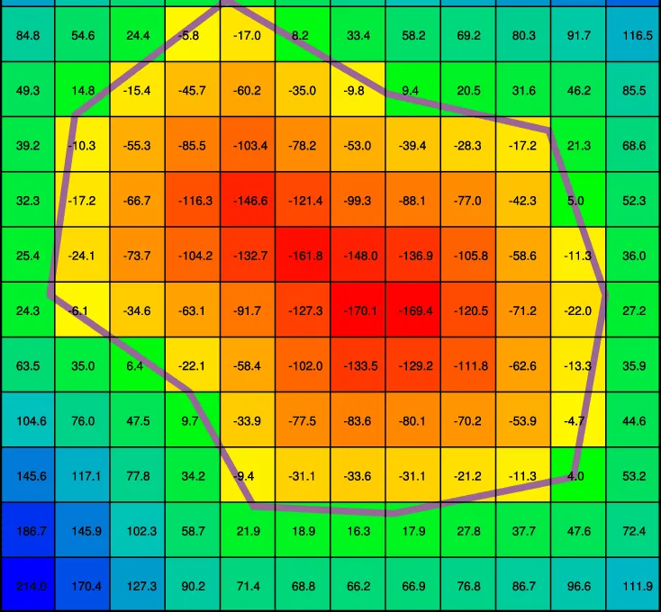
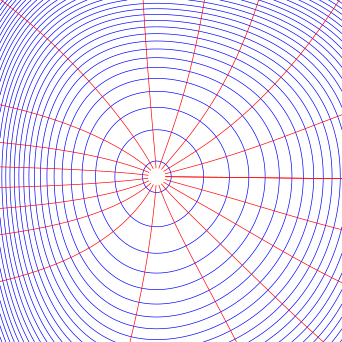
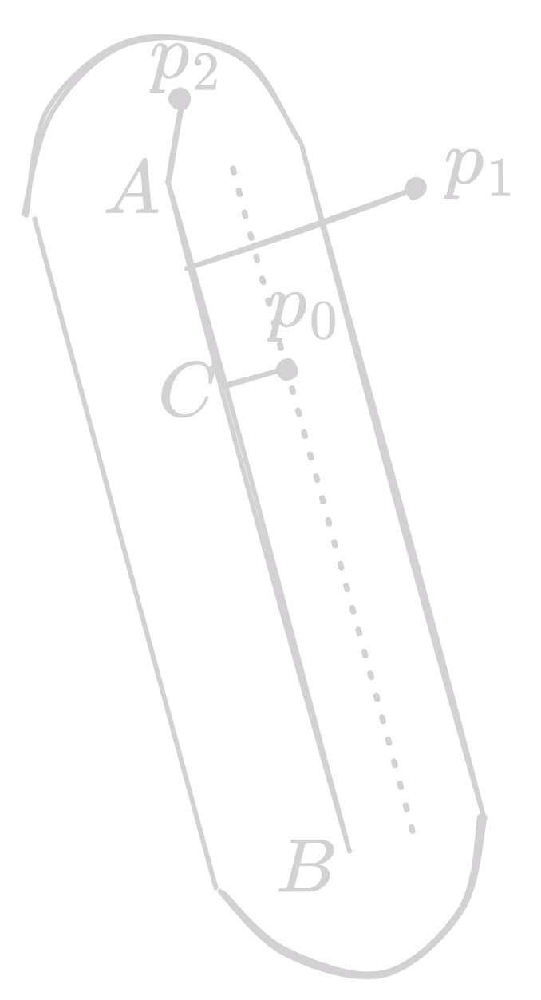
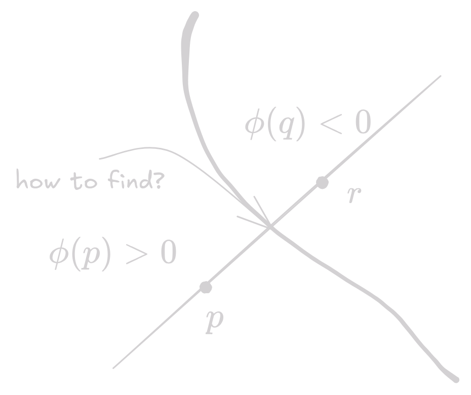
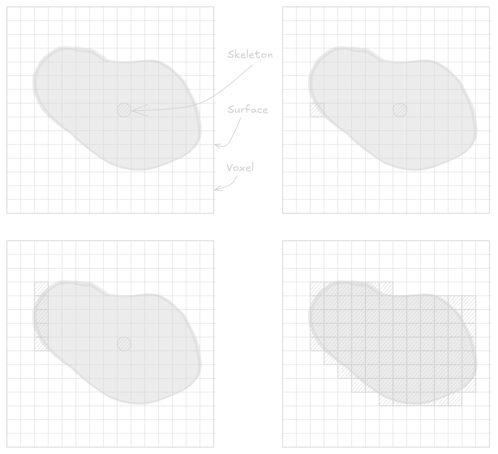
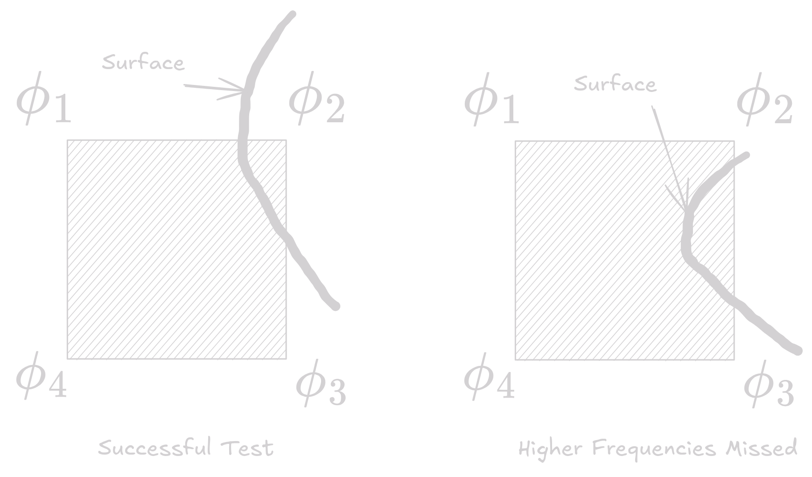
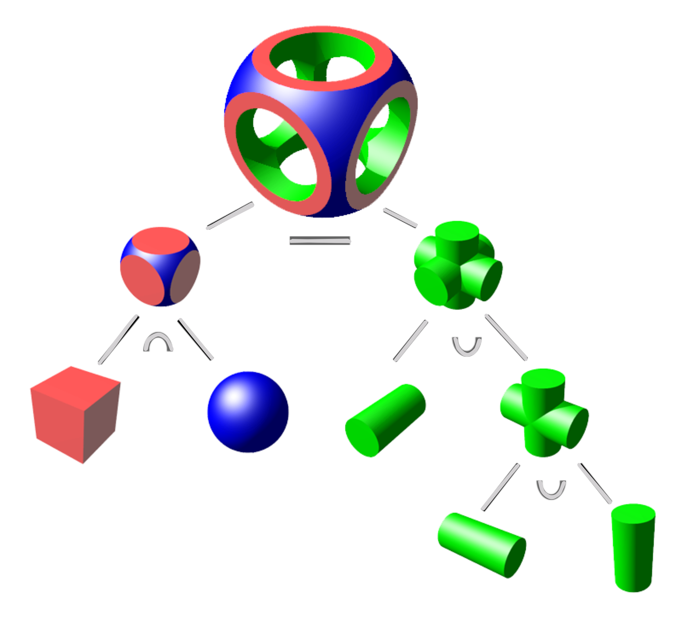

An implicit function is defined as a function $f$ applied to a point $p$ yielding a scalar value $\in \mathbb{R}$, For example the implicit representation of a circle is $C(r) = \{(x, y): x^2 + y^2 - r^2 = 0 \}$

## Implicit Modelling
### Distance Fields

Distance field is defined with respect to some geometric object $T$

$$\mathbf{F}(T, \mathbf{p}) = \min_{\mathbf{q} \in T} \|\mathbf{p} - \mathbf{q}\|$$

$\mathbf{F}(T, \mathbf{p})$ is shortest distance from point $\mathbf{p}$ to the object $T$, where $T$ is any geometric entity embedded in 3D space. A property that all distance fields share is the following

$$|\nabla F| = 1$$

This means the gradient of the distance field is always a unit vector. A way to think about this is that if you move along the gradient of the distance field, you will move exactly one unit of distance.

### Signed Distance Fields

Same idea as distance fields, but attach a sign based on inside/outside w.r.t. the surface. In a discrete setting, usually computed over a set of pixels (e.g. on an image) or in a volumetric grid.

<figure markdown="span">
    { width=500}
    <figcaption>Signed Distance Field</figcaption>
</figure>

A discrete computation of a SDF is $\mathcal{O}(n^2)$ in 2D and $\mathcal{O}(n^3)$ in 3D, where $n$ is the size of the grid.

### Level-set of an implicit function

The level-set of an implicit function $f$ is the set of points where $f$ evaluates to a constant value. For example, the level-set of a circle is the circle itself.

<figure markdown="span">
    { width=500}
    <figcaption>Level-set. Blue is the level set, Red is the gradient</figcaption>
</figure>

### Implicit Function Representation

An implicit function $f_i(x, y, z)$ maybe be split into two parts

- A distance function $d_i(x, y, z)$
- A fall-off filter function $g_i(r)$, where $r$ is the distance from skeleton

$$f_i(x, y, z) = g_i \circ d_i(x, y, z)$$

### Fall-off Filter functions

Field values are maximum at the skeleton, which fall off to zero at a certain distance from the skeleton(finite support). In case of simple blending, global field is the sum of all field values at a point.

$$f(x, y, z) = \sum_{i=1}^{n} f_i(x, y, z)$$

| Filter name | Mathematical form |
|-------------|-------------------|
| Blinn/Blobby | $g(d) = e^{-rd^2}$ |
| Metaballs | $g(d) = \begin{cases} 1 - 3 (\frac{d}{r})^2 & 0 \leq d \leq \frac{2}{3} \\ \frac{3}{2}(1 - \frac{d}{r})^2 & \frac{r}{3} \leq d \leq r \\ 0 & d > r \end{cases}$ |
| Soft Objects | $g(d) = \begin{cases} 1 - \frac{4 d^6}{9 r ^6} + \frac{17 d^4}{9 r^4} - \frac{22 d^2}{9 r^2} & 0 \leq d \leq r \\ 0 & d > r \end{cases}$ |
| Wyvill | $g(d) = \begin{cases} \left(1 - \frac{d^2}{r^2}\right)^3 & 0 \leq d \leq r \\ 0 & d > r \end{cases}$ |

Except Blinn, all of them have a finite support. 

!!! note
    See notes for good illustrations

### Skeletal Primitives

In order to define an implicit function field, distance to the skeletal primitives need to be computed. This is simple for point primitives, but tricky for complex geometries.

#### Line Segment skeleton

A line segment primitive (AB) can be defined as the cylinder around a line with hemispherical end caps. 

<figure markdown="span">
    { width=150}
    <figcaption>Line Segment</figcaption>
</figure>

use $AC$ to compute the distance $CP_0$

$$\vec{AC} = \vec{AB} \frac{AP_0 \cdot AB}{||AB||^2}$$

Then use $CP_0^2 + AC^2 = AP_0^2$

---

Some basic skeletal primitives of 3D objects are

| Object | Skeletal Primitive |
| ------ | ------------------ |
| Sphere | Point |
| Cylinder | Line Segment |
| Cone | Line Segment |
| Torus | Circle |
| Cylinder | Line Segment |
| Disc | Circle |
| Cube | Cube |

### Convolution surfaces

Surfaces produced by convolving a geometric skeleton $S$ with a kernel function $h$

$$f(p) = \int_S g(r) h(p - r) dr $$

where $h$ has finite support.

### Super-elliptic blending

Given two functions $f_A$ and $f_B$, denote a more general blending operator as $A \diamond B$ The Ricchi blend is defined as 

$$f_{A \diamond B} = \left( f_A^{n} + f_B^n \right)^\frac{1}{n}$$

where $n$ is a parameter that controls the blending. ==For $n=1$, this is the same summation, and for $n=\infty$, this is the same as union of the two fields.==

$$
\begin{align*}
\lim_{n \to \infty} \left(f_A^n + f_B^n \right)^\frac{1}{n} &= \max(f_A, f_B) \\
\lim_{n \to -\infty} \left(f_A^n + f_B^n \right)^\frac{1}{n} &= \min(f_A, f_B) \\
\end{align*}
$$

## Rendering

Rendering an implicit function requires searching for a surface at an iso level. There are two main techniques used to render implicit surfaces 

### Ray Tracing

Continue marching along the ray until the sign of the distance field changes. This is the point where the surface is. Then find the normal at that point and shade it.

We have two points $p$ and $q$ and the implicit surface $\phi$ such that $\phi(p) > 0$ and $\phi(q) < 0$. The surface is somewhere between $p$ and $q$. How to find the root?

<figure markdown="span">
    { width=500}
    <figcaption>Root finding</figcaption>
</figure>

- Solve for algebraic expression if $\phi$ is known, but this is not always possible
- Linear interpolation between $p$ and $q$ to find the root. This is not always accurate
- Iterative root finding/Newton's method/Binary search

!!! note
    Only works if the step size is small enough to capture the surface.

### Polygonization

Algorithms based on numerical continuation

- Divide the space into cubic voxels. Implicit field is sampled at the voxel centres in a volumetric grid(consider a dual grid)
- Search for surface starting from a skeletal element(a starting point)
- Add voxel to queue, mark it visited
- Search neighbors
- When done, replace voxel with polygons

#### Phase 1: Marching Cubes

- Starting from the skeletal elements, search for a voxel containing at least one *intersecting edge*
- From this seed voxel, traverse neighbors to find the other voxels containing intersecting edges
- Add such voxels to a queue for processing 

<figure markdown="span">
    { width=800}
    <figcaption>Marching Cubes</figcaption>
</figure>

To find if edge passes through the voxel, check the sign of the field at all 4 corners of the voxel. If all signs are not the same, then the edge passes through the voxel. ==Caveat is voxel size should be small enough to capture the surface.==

<figure markdown="span">
    { width=700}
    <figcaption>Edge Test</figcaption>
</figure>

#### Phase 2: Polygonization

Each voxel is replaced by a set of triangles that best match the shape of the surface in that voxel. 

There are 256 ($2^8$) possible cases, but only 14 unique cases.

#### Problem

- ^^Ambiguous cases^^: When opposite corners of a voxel have same sign and other corners have the other sign
- ^^Under-sampling^^: When the voxel size is too large to capture the surface

## Constructive Solid Geometry

Constructive Solid Geometry (CSG) is a technique to create complex shapes by combining simple shapes using boolean operations. The basic operations are union, intersection, and difference. The object is stored as a tree, where the leaves are the simple shapes(primitives) and the intermediate nodes are the boolean operations.

<figure markdown="span">
    { width=500}
    <figcaption>CSG</figcaption>
</figure>

| Operation | Mathematical form |
|-----------|-------------------|
| Union | $\bigcup_\max f = \max_{i = 0}^{k-1} (f_i)$ |
| Intersection | $\bigcap_\max f = \min_{i = 0}^{k-1} (f_i)$ |
| Difference | $\min\max f = \min \left( f_0, 2 * iso - \max_{j = 1}^{k-1} (f_j) \right)$ |

==CSG Operators create creases, i.e. $C^1$ discontinuities.==

## Warping

Distorting the shape of a surface by warping the space in it's neighborhood. A warp is a continuous function $w(x, y, z): \mathbb{R}^3 \to \mathbb{R}^3$. Define the warped by applying $w$ to the implicit equation

$$f_i(p) = d_i \circ g_i \circ w_i(p)$$

Where $d_i \circ g_i$ is the original implicit function.

Some warps are 

| Warp | Mathematical form |
|------|-------------------|
| Twist | $w(x, y, z) = \begin{Bmatrix} x \cos(\theta(z)) - y \sin(\theta(z)) \\ x \sin(\theta(z)) + y \cos(\theta(z)) \\ z \end{Bmatrix}$ represents twist around z-axis |
| Taper | $s(y) = \frac{y_\max - y}{y_\max - y_\min}$, $w(x, y, z) = \begin{Bmatrix} s(y)x \\ y \\ s(y)z \end{Bmatrix}$ for taper along y-axis |
| Bend | $w(x, y, z) = \begin{Bmatrix} -\sin(\theta)(y - 1/k) + x_0 \\ \cos(\theta)(y - 1/k) + 1/k \\ z \end{Bmatrix}$ for bending around y-axis, $k$ is the bending rate |

!!! note
    See slides for good illustrations

## Surface Reconstruction

Given a set of points, reconstruct the surface that passes through these points. This is a common problem in computer graphics, computer vision, and medical imaging.

There are various methods to do it such as 

- RBF Reconstruction
- Poisson Reconstruction
- MLS(Moving Least Squares) Reconstruction

We will discuss only RBF Reconstruction here.

### Gaussian RBF

Given values $f_i$ at points $p_i$, find a function 

$$s(p) = \sum_{i} \lambda_i \phi(\|p - p_i\|)$$

such that $s(p_i) = f(p_i)$, where $\phi(r) = e^{-\alpha r^2}$ is the Gaussian RBF. The weights $\lambda_i$ are found by solving a linear system of equations.

$$f_i = \sum_{j} \lambda_j \phi(\|p_i - p_j\|)$$

In general, we need a polynomial term

$$f_i = \sum_{j} \lambda_j \phi(\|p_i - p_j\|) + P(p_i)$$

where $P(p) = c + c_x p_x + c_y p_y + c_z p_z$ is a polynomial term. Leads to a linear systems as following

$$
\begin{bmatrix}
\Phi & P \\
P^T & 0
\end{bmatrix}
\begin{bmatrix}
\lambda \\
c
\end{bmatrix}
=
\begin{bmatrix}
f \\
0
\end{bmatrix}
$$

where $\Phi_{ij} = \phi(\|p_i - p_j\|)$ is a $n \times n$ matrix, $P$ is a $n \times 4$ matrix, and $f$ is a $n \times 1$ vector.

### Regularization

Regularization is used to make the system les ill-conditioned. The regularized system is

$$f_i = \sum_{j} \lambda_j \phi(\|p_i - p_j\|) + P(p_i) + k \lambda_i$$

where $k$ is the regularization constant, which leads to the following system

$$
\begin{bmatrix}
\Phi + kI & P \\
P^T & 0
\end{bmatrix}
\begin{bmatrix}
\lambda \\
c
\end{bmatrix}
=
\begin{bmatrix}
f \\
0
\end{bmatrix}
$$
