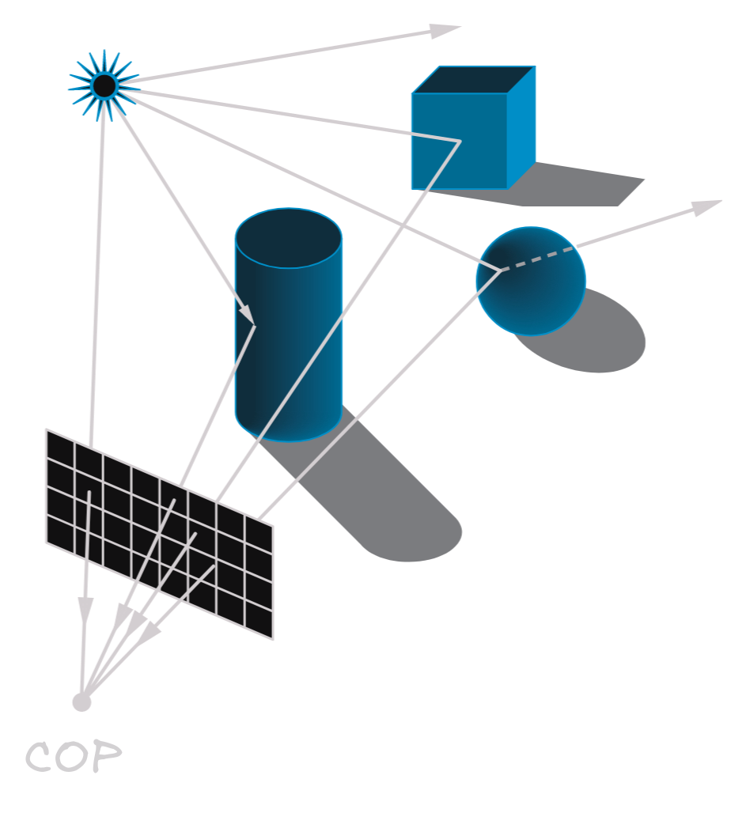
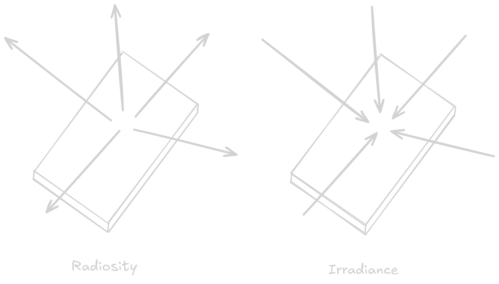
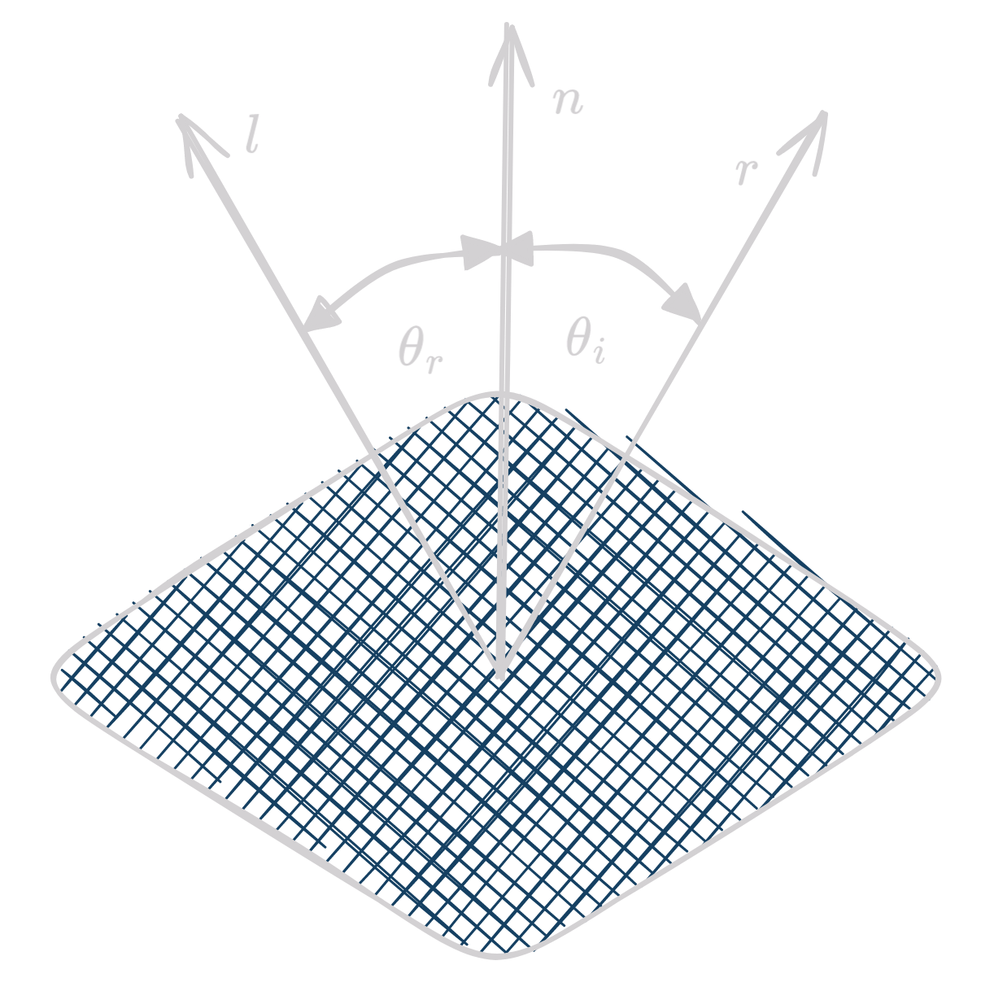
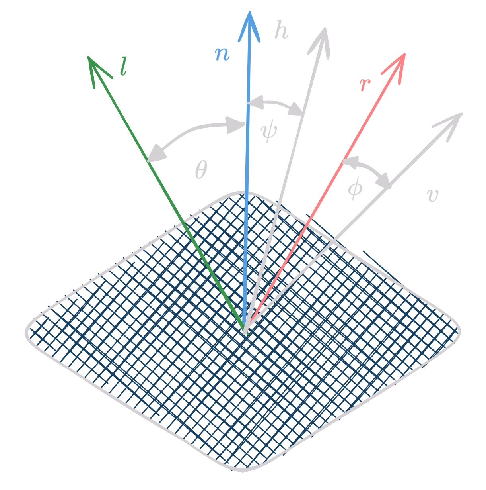
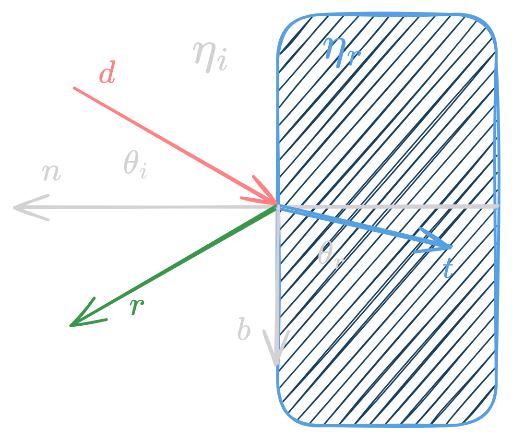

- A surface can emit light (self-emission) or reflect light from other sources.
- Recursive scattering of light between surfaces accounts for subtle shading effects. This can be expressed in the rendering equation.
- The rendering equation can either be physically based or empirical.
- Physically based rendering is very time consuming and expensive to compute, but it produces realistic images.

<figure markdown="span" >
  { width="400" }
  <figcaption>Lighting</figcaption>
</figure>

## Surface types based on light-matter interaction

- **Specular surfaces**: Shiny surfaces that reflect light in a narrow range of directions close to the angle of reflection.
- **Glossy surfaces**: Surfaces that are shiny but not as shiny as specular surfaces.
- **Diffuse surfaces**: Rough surfaces that reflect light in all directions.
- **Translucent surfaces**: Surfaces that allow light to pass through them.

<figure markdown="span">
  { width="700" }
  <figcaption>Surface Types</figcaption>
</figure>

## Physically Based Rendering a.k.a Global Illumination

### Some Terms

- **Flux** ($\Phi(A)$): The amount of light energy passing through a surface per unit time. Unit is watts.
- **Irradiance** ($E(A)$): Flux per unit area arriving at a surface. Unit is watts per square meter.
$$E(A) = \frac{d\Phi(A)}{dA(x)}$$
- **Radioisity** ($B(A)$): The total amount of light energy leaving a surface per unit time. Unit is watts.

<figure markdown="span">
  { width="500" }
</figure>

- **Radiance** ($L(\mathbf{x}, \vec{\omega})$): Flux density per unit solid angle, per perpendicular unit area

$$L(\mathbf{x}, \vec{\omega}) = \frac{d^2\Phi(A)}{d\vec{\omega}dA^\perp (x, \vec{\omega})}$$

- **Solid Angle** ($\Omega$): The angle subtended by a surface at a point in space. Unit is steradian.

$$\Omega = \frac{A}{r^2}$$

## Bidirectional Reflectance Distribution Function (BRDF)

- Ratio between outgoing radiance for angle $\omega_o$ and incoming irradiance for angle $\omega_i$.
- BRDF describes Density w.r.t $\omega_i$. Integrating it over all incoming irradiance gives the total outgoing radiance.

$$\rho(\omega_i, \omega_o) = \frac{d}{d \omega_i} \frac{L_o(\omega_o)}{L_i(\omega_i) \cos{\theta_i}}$$ 

<figure markdown="span">
  { width="500" }
  <figcaption>BRDF</figcaption>
</figure>

<figure markdown="span">
  { width="700" }
  <figcaption>BRDF for different surfaces</figcaption>
</figure>

### Properties of BRDF

- **Positivity**: $\rho(\omega_i, \omega_o) \geq 0$
- **Reciprocity**: $\rho(\omega_i, \omega_o) = \rho(\omega_o, \omega_i)$
- **Energy Conservation**: 

$$\forall \omega_i: \int_{\Omega} \rho(\omega_i, \omega_o) d\omega_o \leq 1$$

## The rendering equation

$$L_o(\mathbf{x}, \vec{\omega_o}) = E_o(\mathbf{x}, \vec{\omega_o}) + \int_{\Omega} \rho(\mathbf{x}, \vec{\omega_i}, \vec{\omega_o}) L_i(\mathbf{x}, \vec{\omega_i}) \cos{\theta_i} d\omega_i$$

This is too complicated to understand, so we will reduce it to a simpler form.

- Unknown function $L$ is related to linear operator (integration) on itself + emission function $E$.
- Discrete
    - Functions $\rightarrow$ Vectors, Linear operators $\rightarrow$ Matrices
    - $L = E + K \cdot L$
    - Linear system of equations
- Rendering becomes solving a linear system of equations. 

$$
\begin{align*}
L &= E + K \cdot L \\
L &= (I - K)^{-1} \cdot E \\
&= \sum_{i=0}^{\infty} K^i \cdot E
\end{align*}
$$

The last line is formed by the Neumann series expansion of $(I - K)^{-1}$.

## Light Paths

- Heckbert's notation for light paths:
- Expresses light paths in terms of surface interactions
- $L$ - Light source
- $E$ - Eye
- $S$ - Specular reflection/refraction
- $D$ - Diffused reflection

We can represent light paths as a regular expression

- `*` - Zero or more occurrences
- `+` - One or more occurrences
- `?` - Zero or one occurrence
- `|` - OR

Heckbert's classification of light paths:

- Direct illumination: $L(D|S)E$
- Indirect illumination: $L(D|S)D(D|S)+E$
- Classical (Whitted) ray tracing: $LDS*E$
- Full global illumination: $L(D|S)*E$

## Approximate models

### Phong Reflection Model
- Blinn-Phong reflection model is a simplified model that approximates the shading of a surface.
- Efficient to compute and provides good results.
- Consists of three components: ambient, diffuse, and specular reflection.

$$I = I_a + I_d + I_s$$

<figure markdown="span">
  { width="500" }
  <figcaption>Phong Model</figcaption>
</figure>

#### Ambient Reflection
- Any point whose normal is not facing the light source will appear black.
- In reality, light bounces off other surfaces and illuminates the point.
- An ambient term is added to account for this.

$$I_a = k_a \cdot I_{a}, \text{ where } 0 \leq k_a \leq 1 $$

#### Diffuse Reflection

- Lambertian objects reflect light equally in all directions.
- No change in color with respect to the angle of view.
- Lambert's cosine law: intensity is proportional to the cosine of the angle between the light source and the normal. If $l$ is the light vector (pointing towards the light source) and $n$ is the normal vector, then the intensity $c$ is given by:

$$c \propto n \cdot l$$

- Reflection coefficient $k_d$ represents fraction of light reflected.

$$I_d = k_d \max((l \cdot n) L_d, 0)$$

#### Light source Attenuation

- Energy decreases as the inverse square with distance 
- Therefore for diffuse lighting, 

$$I_d = k_d f_{att} \max((l \cdot n) L_d, 0)$$

where $f_{att}$ is the light source attenuation function 

- A common attenuation function is

$$f_{att} = \min\left(\frac{1}{a + bd + cd^2}, 1\right)$$

where $d$ is the distance between the light source and the point, and $a$, $b$, and $c$ are constants.

#### Specular Reflection

- Phong lighting model adds a specular reflection term to the lighting equation.
- The amount of light that the viewer sees depends on the angle $\phi$ between $r$ (reflected direction) and $v$ (view vector).

$$I_s = k_s L_s \max((r \cdot v)^n, 0)$$

where $n$ is the shininess coefficient.

!!! abstract "Reflected Vector"
    Two fundamental conditions
    - Angle of incidence = Angle of reflection
    - At a point $p$ on the surface, the incident light vector $l$ and the reflected light vector $r$ are coplanar with the normal vector $n$ at $p$.
  
    <figure markdown="span">
      { width="300" }
    </figure>

    - $\theta_i = \theta_r \implies \cos{\theta_i} = \cos{\theta_r} \implies l \cdot n = r \cdot n$
    - $r = \alpha n + \beta l$ 
    - $n \cdot r = n \cdot (\alpha n + \beta l) = \alpha n \cdot n + \beta n \cdot l = \beta n \cdot l = l \cdot n$
    - $l = r \cdot r = \alpha^2 + 2 \alpha \beta l \cdot n + \beta^2 = 1$
    - $r = 2(n \cdot l)n - l$
  

#### Putting it all together

$$I = \frac{1}{a + bd + cd^2} (k_d L_d \max((l \cdot n), 0) + k_s L_s \max((r \cdot v)^n, 0)) + k_a I_a$$

The diffuse and are computed and added for each light source.

If there are multiple light sources, then separate diffuse and specular terms are computed for each light source and added together.

$$I = k_a I_a + \sum_{i=1}^{n} (f_{att} (k_{d_i} L_{d_i} \max(l_i \cdot n, 0)) + k_{s_i} L_{s_i} \max((r_i \cdot v)^n, 0))$$

### Modified Phong Model

- With Phong model, the reflected vector $r$ needs to be computed at every point on surface 
- To avoid this expensive computation, halfway vector $h$ is used.

$$h = \frac{l + v}{||l + v||}$$

- Replace $r \cdot v$ with $h \cdot n$ with $n \cdot h$.
- Phong highlights will be smaller than before

<figure markdown="span">
  { width="500" }
  <figcaption>Modified Phong Model</figcaption>
</figure>

### Transparent Surfaces

- Both specular and diffuse transmissions can take place at the surfaces of a transparent surface. 
- When a beam of light is incident on a transparent material, part of it is reflected and part of it is refracted.

!!! note "Snell's Law"
    - The angle of incidence and the angle of refraction are related by Snell'js Law.
    - $\eta_i \sin{\theta_i} = \eta_r \sin{\theta_r}$
    - $\eta_i$ and $\eta_r$ are the refractive indices of the incident and refracted media respectively.
    - $\theta_i$ and $\theta_r$ are the angles of incidence and refraction respectively.  
<figure markdown="span">
  { width="500" }
  <figcaption>Refraction</figcaption>
</figure>

- Refraction occurs whenever light passes from one medium to another with a different refractive index.
- Law of refraction: Incident ray $d$, refracted ray $t$ and normal $n$ are coplanar.

Let $n$ and $b$ be basis vectors of the plane containing $d$ and $t$.

- $t = \sin{\theta_r} b - \cos{\theta_r} n$
- $d = \sin{\theta_i} b - \cos{\theta_i} n \implies b = \frac{d + n \cos{\theta_i}}{\sin{\theta_i}}$

$$
\begin{align*}
t &= \frac{\eta_i}{\eta_r} (d + n\cos{\theta_i}) - n \cos{\theta_r}\\
&= \frac{\eta_i}{\eta_r} (d - n(d \cdot n)) - n \sqrt{1 - \left(\frac{\eta_i}{\eta_r}\right)^2 (1 - (d \cdot n)^2)}\\
\end{align*}
$$

### Fresnel Equations

- Reflectivity of a dielectric surface varies with the angle of incidence according to the Fresnel equations.
- Schlick's approximation is a common way to approximate the Fresnel equations.

$$ R(\theta) = R_0 + (1 - R_0)(1 - \cos{\theta})^5$$

where $R_0$ is the reflectance at normal incidence, and $\theta$ is the angle of incidence.

$$R_0 = \left(\frac{\eta_r - 1}{\eta_r + 1}\right)^2$$

Thus,

$$I = (1 - R(\theta)) I_{trans} + R(\theta) T_{refl}$$

## Polygon Rendering Methods

### Flat Shading

- All points within a face of the model are assigned the same color.
- All vertices of the face have same normal.
- Gives a faceted look to the model.

### Gouraud Shading

- Also known as intensity interpolation.
- Linearly interpolates vertex intensities across the face.
- All vertices of the face have different normals.

### Phong Shading

- Also known as normal vector interpolation.
- Interpolates normal vectors across the face instead of intensities.
- All points within a face have different normals.