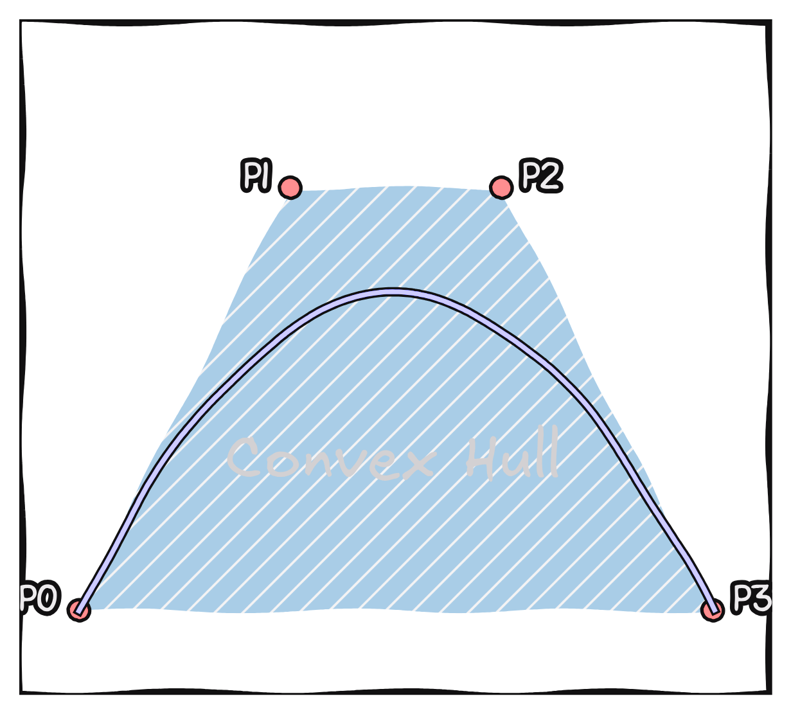
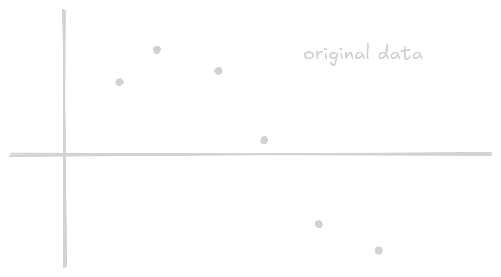
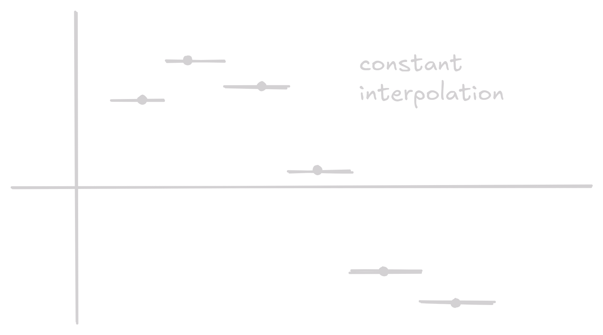
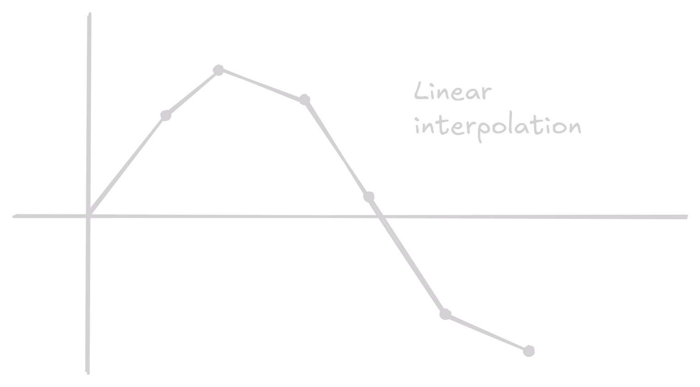
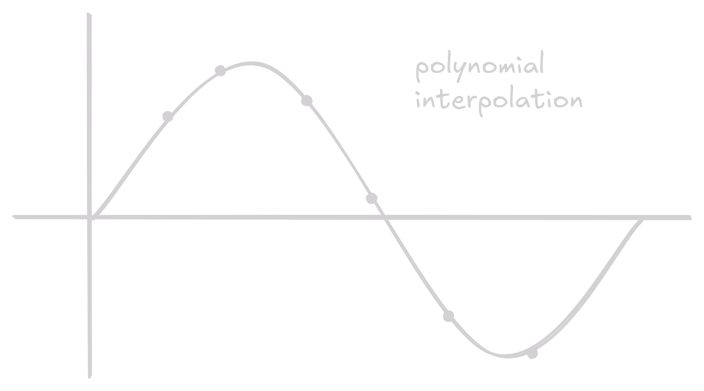
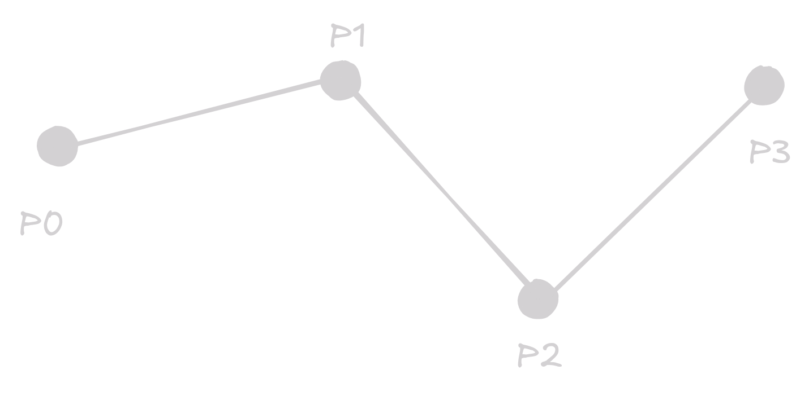
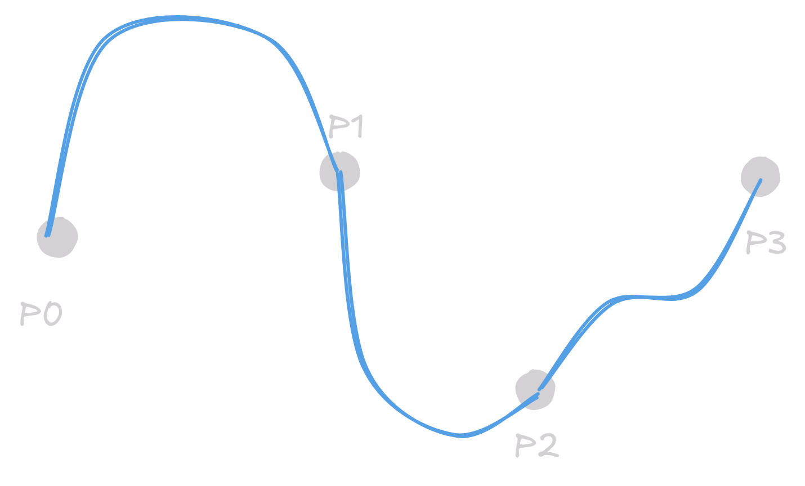

Path of a continuously moving point in the space. Set of all points where the moving point has been.

## Mathematical Description
- Parametric Curves:
    - In 2D: $C(t) = (x(t), y(t)), C: \mathbb{R} \rightarrow \mathbb{R^2}$
    - In 3D: $C(t) = (x(t), y(t), z(t)), C: \mathbb{R} \rightarrow \mathbb{R^3}$
- Implicit Curves: Defined as the set of points satisfying an equation $f(x, y) = 0$.
    - In 2D: $C = \{(x, y): f(x, y) = 0 \}$
    - In 3D: $C = \{(x, y, z): f(x, y, z) = 0 \}$

!!! warning
    Always ensure that Implicit curves are of the form $f(x, y) = 0$ and not $f(x, y) = c$.

### Some representations of popular curves

| Curve | Parametric | Implicit |
|-------|------------|----------|
| Line  | $p(t) = p_0 + (p_1 - p_0)t, t \in (-\infty, \infty)$ | $C = \{(x, y): ax + by + c = 0\}$ |
| Circle | $p(t) = (r\cos(t), r\sin(t)), t \in [0, 2\pi]$ | $C = \{(x, y): x^2 + y^2 - r^2 = 0\}$ |

!!! note
    Always mention the range of the parameter $t$ when defining a parametric curve.

**Parametric Polynomial Curves**: $C(t) = \{x(t), y(t)\}$ is polynomial iff $x(t)$ and $y(t)$ are polynomials in $t$.

## Approximation Curves
Do not need to interpolate all the points(i.e. pass through all the points). Approximation curves are used to represent the shape of the curve.

Examples:

- Bezier Curves
- B-Spline Curves
- Catmull-Rom Splines
- etc.

## Bezier Curves
<figure markdown="span">
  { width="600" }
  <figcaption>Quadratic Bezier Curve</figcaption>
</figure>

Bezier curves are defined by a set of control points. Nth order Bezier curve is defined by N+1 control points. Equation of Linear Bezier curve is given by:

$$B^1(t) = (1-t)P_0 + tP_1$$

where $P_0$ and $P_1$ are the control points. Bezier curves are defined recursively. The general equation for Nth order Bezier curve is given by:

$$B^n(t) = (1-t)B^{n-1}(t) + tB^{n-1}(t)$$

or they can be defined using all the control points as:

$$B^n(t) = \sum_{i=0}^{n} {n \choose i} (1-t)^{n-1}t^i P_i$$

where ${n \choose i}$ is the binomial coefficient, and $P_i$ are the control points.

### Properties of Bezier Curves
- The curve always passes through the end points, i.e. $B^n(0) = P_0$ and $B^n(1) = P_n$.
- The curve is a straight line iff all the control points are collinear.
- The start and end tangent vectors are parallel to the line joining the first and last control points, i.e.

    $$\frac{dB}{dt}|_{t = 0} \propto \overrightarrow{P_0 P_1} \hspace{40px} \text{ and } \hspace{40px} \frac{dB}{dt}|_{t = 1} \propto \overrightarrow{P_{n-1} P_n}$$

- Convex Hull Property: The curve lies within the convex hull of the control points.
<figure markdown="span">
  { width="600" }
  <figcaption>Convex Hull (the boundary is P0 P1 P2 P3)</figcaption>
</figure>

!!! note
    Convex Hull is the smallest convex set that contains all the control points. Convex set is a set where the line segment joining any two points in the set lies entirely within the set.

- Each $n$th order Bezier curve has an equally shaped $n+1$th order Bezier curve
- Is Affine Invariant: The curve remains the same under affine transformations (i.e. translation, rotation, scaling, and shear).

??? info "Rational Bezier Curves"
    Rational Bezier curves are defined by dividing each control point by a weight. The equation for Rational Bezier curve is given by:

    $$B^n(t) = \frac{\sum_{i=0}^{n} {n \choose i} (1-t)^{n-1}t^i w_i P_i}{\sum_{i=0}^{n} {n \choose i} (1-t)^{n-1}t^i w_i}$$

    where $w_i$ are the weights. They have better local control and can represent conic sections, but they are computationally expensive.

## Interpolation Curves
Given a set of points $P_0, P_1, \dots, P_n$ , we want to construct a curve that passes through all the points. $C(k) = p_k$ where $k = 0, 1, \dots, n-1$.

Some interpolation curves are:

- Lagrange Interpolation
- Piecewise Bezier Curves
- Piecewise B-Spline Curves
- etc.

{ width="350" } { width="350" }
{ width="350" } { width="350" }
<figure>
<figcaption>Different types of interpolation</figcaption>
</figure>

### Lagrange Interpolation
Given a set of points $P_0, P_1, \dots, P_n$, the Lagrange interpolation polynomial is given by:

$$L(k) = \sum_{i=0}^{n} P_i l_i(k)$$

where $l_i(k)$ are the Lagrange basis functions given by:

$$l_i(k) = \prod_{j=0, j \neq i}^{n} \frac{k - k_j}{k_i - k_j}$$

We rarely use Lagrange interpolation in practice because of the huge oscillations and large interpolation error.

## Piecewise Interpolation Curves

Known as "Poly-Curves". Each segment  between two interpolation points is represented by a curve. 

{ width="350" } { width="350" }
<figure>
<figcaption>Two types of interpolation, Linear on the right and Cubic Bezier on the left</figcaption>
</figure>

### Continuity in Piecewise Curves

Parametric Continuity $C^n$

- Segments have equal $n$th derivative at the junction points.
- Tangents have equal direction and magnitude at the junction points.

| Continuity | Description |
|------------|-------------|
| $C^-1$ | Curve is discontinuous |
| $C^0$ | Curve is continuous |
| $C^1$ | First Derivative is continuous |
| $C^2$ | Second Derivative is continuous |
| $C^n$ | $n$th Derivative is continuous |

Geometric Continuity $G^n$: Tangents have equal direction but not magnitude at the junction points. Curve is $G^n$ continuous if it can be reparametrized to be $C^n$ continuous.

| Continuity | Description |
|------------|-------------|
| $G^0$ | Curve touch at the joint point (=$C^0$) |
| $G^1$ | Curves share a common tangent direction |
| $G^2$ | Curves share a common center of curvature |

