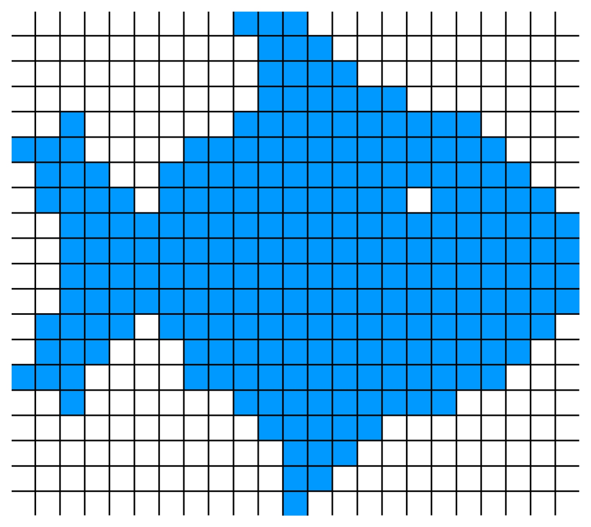
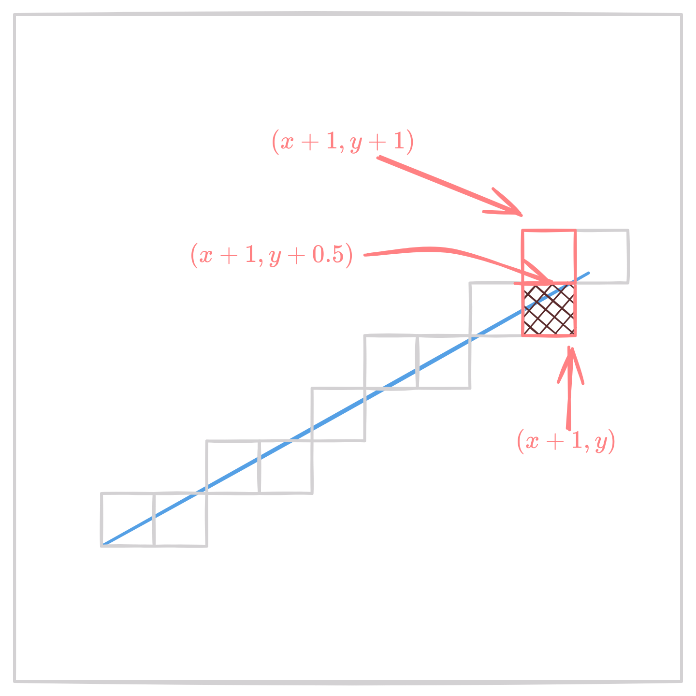

Rasterization is the process of converting vector graphics into raster graphics. It is a key step in the rendering pipeline, and is responsible for converting the 3D scene into a 2D image that can be displayed on a screen. It consists of 

- Enumerating the pixels that are covered by each primitive in the scene
- Interpolating the attributes of the primitive across the pixels
- Output a set of fragments for each pixel, which will be shaded in the next stage of the pipeline. Fragment contains the interpolated attributes of the primitive, such as color, depth, and texture coordinates.

<figure markdown="span">
    { width="600" }
  <figcaption>Rasterization</figcaption>
</figure>

## Rasterizing Lines

### DDA Algorithm

$$ m = \frac{dy}{dx} = \frac{y_1 - y_0}{x_1 - x_0} = \frac{\Delta y}{\Delta x} $$

For $\Delta x$ change in x-coordinate, change in y-coordinate is $\Delta y = m \Delta x$.

### Midpoint Line Algorithm

- Drawing lines using implicit equation of line $f(x, y) = (y_0 - y_1)x + (x_1 - x_0)y + x_0y_1 - x_1y_0 = 0$.
- Assume $x_0 < x_1$. If not, swap points.
- $m = \frac{y_1 - y_0}{x_1 - x_0}$

Basic idea is the following

- Next potential pixel is either $(x + 1, y)$ or $(x + 1, y + 1)$.
- Midpoint : $(x + 1, y + 0.5)$
- If line passes below midpoint, choose $(x + 1, y)$, else choose $(x + 1, y + 1)$.

```python
y = y_0
for x = x_0 to x_1:
    draw(x, y)
    if f(x + 1, y + 0.5) < 0:
        y = y + 1
```

<figure markdown="span">
    { width="600" }
  <figcaption>Midpoint Line Algorithm</figcaption>
</figure> 

More efficient version would be to reuse computation. Inside the loop, one of these is already evaluated in the last step: $f(x - 1, y + 0.5)$, $f(x - 1, y - 0.5)$. Use the relation

$$f(x + 1, y) = f(x, y) + (y_0 - y_1)$$

$$f(x + 1, y + 1) = f(x, y) + (y_0 - y_1) + (x_1 - x_0)$$

```python
y = y_0
d = 2(y_0 - y_1)(x_0 + 1) + (x_1 - x_0)(2y_0 + 1) + 2(x_0y_1 - x_1y_0)

for x = x_0 to x_1:
    draw(x, y)
    if d < 0:
        y = y + 1
        d += 2(x_1 - x_0)
    d += 2(y_0 - y_1)
```

## Rasterizing Circles - Midpoint Circle Algorithm

- Drawing circles using implicit equation of circle $f(x, y) = x^2 + y^2 - r^2 = 0$.
- Draw octant of a circle and reflect it to get the full circle.

```python
x = 0
y = r
d0 = (1, r - 1/2) = 1 + (r - 1/2)^2 - r^2 = 5/4 - r
d0 = round(d0) = 1 - r if r is integer

while x < y:
    draw(x, y)
    x += 1
    if d < 0:
        d += 2x + 3
    else:
        d += 2(x - y) + 5
        y -= 1
```

<figure markdown="span">
    { width="400" }
  <figcaption>Midpoint Circle Algorithm</figcaption>
</figure>

## Rasterizing Triangles

- Drawing a 2D triangle with points $a(x_a, y_a), b(x_b, y_b), c(x_c, y_c)$.
- Color interpolation using barycentric coordinates. $c = \alpha c_0 + \beta c_1 + \gamma c_2$ where $\alpha + \beta + \gamma = 1$.
- Rasterize adjacent triangles so that there are no holes

### Barycentric Coordinates

For a point P inside a triangle, $P = \alpha P_0 + \beta P_1 + \gamma P_2$ where $\alpha + \beta + \gamma = 1, \alpha, \beta, \gamma \geq 0$.

$$f_{ac}(x, y) = (y_a - y_c)x + (x_c - x_a)y + x_ay_c - x_cy_a = 0$$

We can find value of $\alpha, \beta, \gamma$ as follows

$$
\begin{align*}
\beta &= \frac{f_{ac}(x, y)}{f_{ac}(x_b, y_b)} \\
\gamma &= \frac{f_{ab}(x, y)}{f_{ab}(x_c, y_c)} \\
\alpha &= 1 - \beta - \gamma
\end{align*}
$$

```python

def barycentric(a, b, c, x, y):
    beta = f_ab(x, y) / f_ab(x_c, y_c)
    gamma = f_ac(x, y) / f_ac(x_b, y_b)
    alpha = 1 - beta - gamma

    return alpha, beta, gamma

x_min, y_min, x_max, y_max = bounding_box(a, b, c)

for y in range(y_min, y_max):
    for x in range(x_min, x_max):
        alpha, beta, gamma = barycentric(a, b, c, x, y)
        if alpha >= 0 and beta >= 0 and gamma >= 0:
            c = alpha * c_a + beta * c_b + gamma * c_c
            draw(x, y) with color c
```

!!! note "What about boundary pixels?"
    In order to ensure no gaps remain between adjacent triangles,

    - Either choose to draw the edge of one of the triangles (harder to implement)
    - Or draw the edge of both triangles (easier to implement)