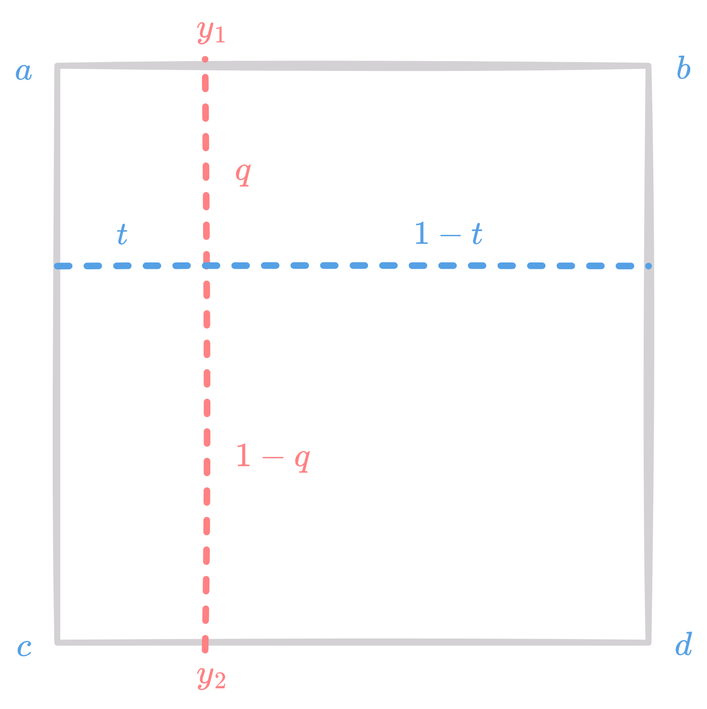
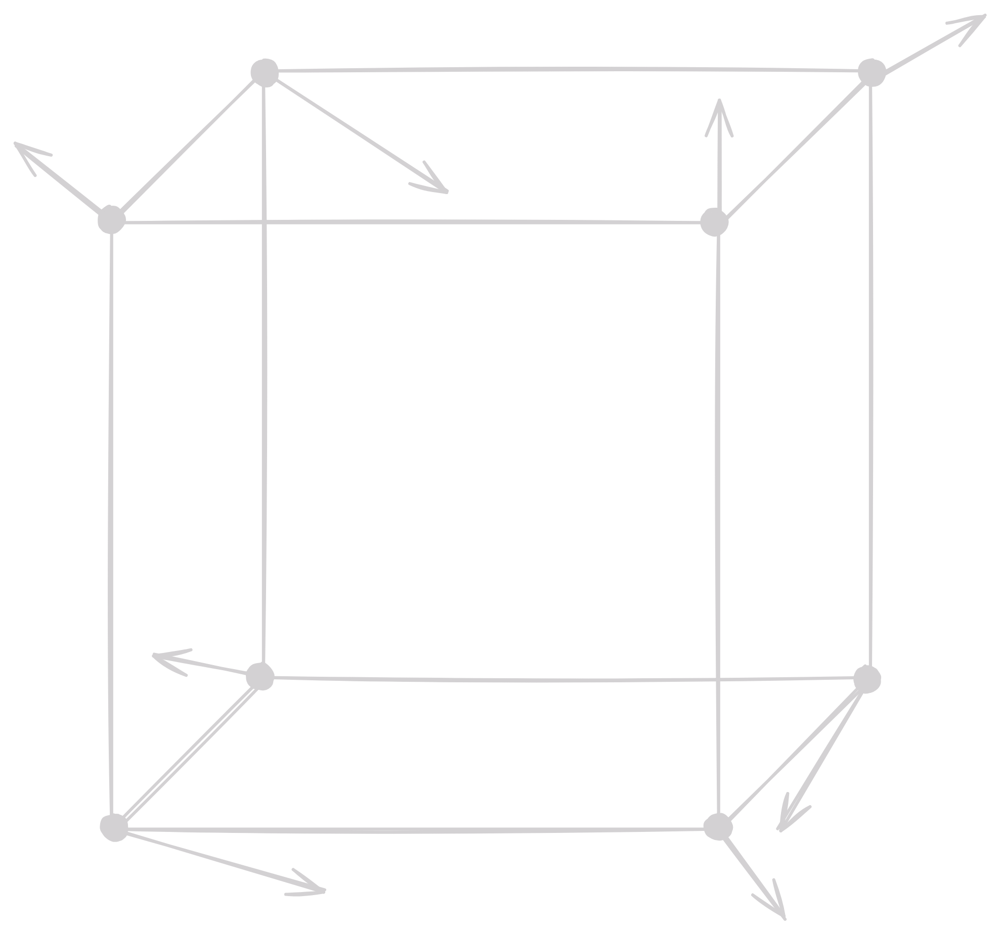
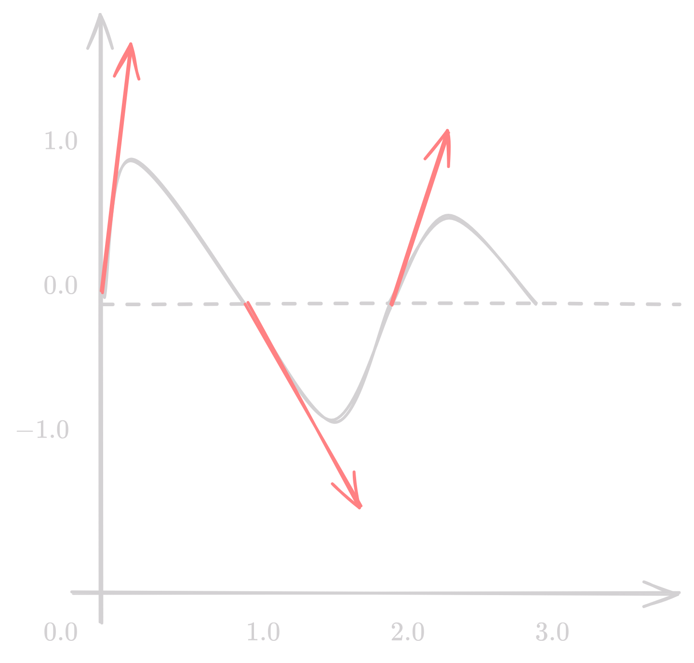

Objects have variation in reflectance across surface. A common technique to handle such variation is to store the reflectance as a function or a pixel-based image and "map" it onto the surface. This function or image is called **Texture**, and the process of controlling reflectance properties of objects using textures is called **Texture Mapping**.

## 2D Texture Mapping
- Local 2D coordinate system called *uv* is used to create reflectance $R(u,v)$.
- During texture mapping, each surface point $(x,y,z)$ is assigned a 2D coordinate $(u,v)$ and colored with $R(u,v)$.


### Texture mapping on sphere

- To map $(u, v)$ onto a sphere, we first compute spherical coordinate
    - $x = x_c + r \sin(\theta) \cos(\phi)$
    - $y = y_c + r \sin(\theta) \sin(\phi)$
    - $z = z_c + r \cos(\theta)$
    - $\theta = arccos(\frac{z - z_c}{r})$
    - $\phi = arctan2(y - y_c, x - x_c)$ 
- Required mapping becomes
    - $u = \frac{\phi + \pi}{2\pi}$
    - $v = \frac{\theta}{\pi}$ 

<figure markdown="span">
    { width=400}
    <figcaption markdown="span">Texture mapping on sphere</figcaption>
</figure>

### Texture mapping on triangle

- At any point $(\beta, \gamma)$ inside a triangle, the $(u, v)$ coordinates can be computed as
    - $u = = (1 - \beta - \gamma)u_a + \beta u_b + \gamma u_c$
    - $v = = (1 - \beta - \gamma)v_a + \beta v_b + \gamma v_c$
- Here, $(u_a, v_a)$, $(u_b, v_b)$, and $(u_c, v_c)$ are the texture coordinates at the vertices of the triangle.

### Perspective correct texture mapping

- Accounts for the actual 3D position of the point on the surface.
- Screen space interpolation is used to compute $(u, v)$ at each pixel.

$$f_x = (1 - \alpha) \frac{x_0} {w_0} + \alpha \frac{x_1} {w_1}$$

- Perspective correct interpolation of $(u, v)$ is given by

$$f_x = \frac{(1 - \beta) x_0 + \beta x_1} {(1 - \beta) w_0 + \beta w_1}$$

- Post Perspective, use 

$$\beta = \frac{\alpha * w_0}{(1 - \alpha) w_1 + \alpha w_0}$$

## Texture coordinates

How to specify mapping from an object to a texture? It should have the following properties

- ==Piecewise Linearity==: in order to use interpolation hardware
- ==Invertible==: go back and forth between object and texture space
- ==Easy to Compute==
- ==Area Preserving== or ==Angle Preserving==

Some Common texture mappings are 

- Linear/Planar/Hyperplanar Projection
- Cylindrical 
- Spherical
- Piecewise-linear or Piecewise-Bilinear on a plane from explicit per-vertex texture coordinates
- Normal-vector projection onto a sphere


!!! note
    Look at slides for images

| Texture Mapping | Description | Use case |
| --- | --- | --- |
| Planar Texturing | Image is projected orthographically onto the object. | Texturing flat surfaces |
| Cylindrical Texturing | Image is projected onto the object using a cylinder. | Texturing cylinders, cones, and other objects that have some central axis |
| Spherical Texturing | Image is projected onto the object using a sphere. | Texturing blobs, spheres, and other objects that are roughly spherical |
| Box Texturing | Image is projected onto the object from all six sides of a cube. | Texturing cubes and other objects that are roughly box-shaped |
| UV Texturing | Explicit per-vertex texture coordinates are used to map the texture onto the object. | Texturing objects with complex geometry |


## Texture filtering

- During texture mapping, one pixel on a textured surface may not correspond to one texel.
- Insufficient resolution may lead to aliasing artifacts/jaggies.
- Can lead to both minification and magnification artifacts.

| Method | Description |
| --- | --- |
| Nearest Neighbor | Simplest method, picks the nearest texel. |
| Bilinear | Find closest matching source pixel grid and interpolate between 4 neighboring texels. |
| Mipmapping | Precompute multiple versions of the texture at different resolutions using high-quality filtering, and then do nearest neighbor or bilinear filtering on the mipmap. |
| Anisotropic | Recognize when a texture is being stretched in one direction more than another and takes larger number of samples to compensate. |

### Bilinear Interpolation

Say we are given a 2D image, and we want to estimate the value of a pixel at a non-integer coordinate. We can use bilinear interpolation to estimate the value of the pixel. 

<figure markdown="span">
    { width=400}
    <figcaption markdown="span">Bilinear Interpolation</figcaption>
</figure>

We first start off with finding the value of $y_1$ and $y_2$ using linear interpolation.

$$
\begin{align*}
    y_1 &= a + (b - a) \cdot t \\
    y_2 &= c + (d - c) \cdot t
\end{align*}
$$

Then, we interpolate these values across the other axis to get the final value.

$$y = y_1 + (y_2 - y_1) \cdot q$$

## Texture Synthesis

Procedural texture: little programs that computes color as a function of $(x, y, z)$.

Types of procedural textures

- ==Fourier-like synthesis==
- ==Perlin noise==
- Reaction-diffusion textures - Simulating formation of patterns in nature, which evolve through diffusion and reaction.
- Data-driven textures - Use data from real-world sources to generate textures. Using minimal error boundary cut to create seamless textures.

### Fourier-like Synthesis

Displacement function $d(x, y)$ is represented as a sum of sinusoids.

$$d(x, y) = \sum_{i=0}^{n-1} c_i cos(a_i x + b_i y + \phi_i)$$

Where $(a_i, b_i)$ are chosen randomly from annular region in plane $r^2 \leq a_i^2 + b_i^2 \leq R^2$. This can be used for representing cloud density, placement of vegetation, etc.

### Perlin Noise

Perlin noise is a type of gradient noise developed by Ken Perlin. It is used in computer graphics for procedural texture generation. It is used to generate textures that look like natural phenomena such as clouds, fire, and marble.

<figure markdown="span">
    { width=400}
    <figcaption markdown="span">Perlin Noise</figcaption>
</figure>

The basic idea is to generate a grid of random gradient vectors, and then interpolate between them to get a smooth continuous noise function. The noise function is then used to generate textures.

Consider a simpler example in 1D. The values at integer are zero, but they have random gradient vectors. The values at non-integer points are interpolated between the two nearest integer points.

<figure markdown="span">
    { width=400}
    <figcaption markdown="span">Perlin Noise in 1D</figcaption>
</figure>

For a point $p(x, y, z)$ in the grid,

$$n(x, y, z) = \sum_{i = \lfloor x  \rfloor}^{\lfloor x  \rfloor + 1} \sum_{j = \lfloor y  \rfloor}^{\lfloor y  \rfloor + 1} \sum_{k = \lfloor z  \rfloor}^{\lfloor z  \rfloor + 1} \Omega_{ijk} (x - i, y - j, z - k)$$

Where 

$$\Omega_{ijk}(u, v, w) = \omega(u) \omega(v) \omega(w) (\Gamma_{ijk} \cdot (u, v, w))$$

$$\omega(t) = 2 |t|^3 - 3 |t|^2 + 1 , |t| < 1, 0 \text{ otherwise }$$

| Function | Meaning |
| --- | --- |
| $\Gamma_{ijk}$ | Random gradient vector at $(i, j, k)$ |
| $\omega(t)$ | Weight function, also called ease curves |
| $\Omega_{ijk}$ | Weighted gradient vector |

#### Algorithm

```python
def PerlinNoise(p: Point):
    n: float = 0 # noise value
    for (Point q : neighborhood of p)
        g = gradient(q) # precomputed random gradient
        d = p - q
        n += dot(d, g) * weight(d)
```

!!! note
    Look at slides for images


## Other Discrete Techniques

### Bump Mapping

!!! note
    Look at slides for images

Creates the illusion of surface detail by perturbing the surface normal using a height map. Let $p(u, v)$ be a point on a parametric surface. The normal is given by

$$N(u, v) = \frac{p_u \times p_v}{|p_u \times p_v|}$$

Where $p_u$ and $p_v$ are the partial derivatives of $p$ with respect to $u$ and $v$.

Now let the the displacement be given by a displacement map $d(u, v)$, then the displaced surface can be written as $p' = p + d(u, v)N(u, v)$, and displaced normal becomes

$$N' = p_u' \times p_v'$$

Computing partial derivatives of $p'$, we get

$$
\begin{align*}
p_u' &= p_u + \frac{\partial d}{\partial u}N + d \frac{\partial N}{\partial u}\\
p_v' &= p_v + \frac{\partial d}{\partial v}N + d \frac{\partial N}{\partial v} \\
\end{align*}
$$

For small displacements, we can ignore the second order terms and get

$$N' \approx N + \frac{\partial d}{\partial u}N \times p_v + \frac{\partial d}{\partial v}N \times p_u$$

### Normal Mapping

Instead of computing the normal at each point, we store the normal in a texture map as RBG values. There are two ways to store the normal in the texture map

- Object space normal mapping: Normal is stored in the object space of the surface. This allows the map to be applied to a specific surface.
- Tangent space normal mapping: Normal is stored in the tangent space of the surface. This allows the map to be applied to any surface. 

!!! Question "Why is Tangent-space map blue in color?"
    The tangent space is defined by the surface normal, the tangent, and the bitangent. The normal map is stored in the RGB channels of the texture. The red, green, and blue channels correspond to the x, y, and z components of the normal in the tangent space. The normal map is blue in color because the z component of the normal is stored in the blue channel.

To accurately compute tangent space,

- $m = \frac{n}{|n|}$, where $m$ is the normal vector
- $t = \frac{p_u}{|p_u|}$, where $t$ is the tangent vector
- $b = m \times t$, where $b$ is the bitangent vector

Formulate the rotation matrix $M$ as

$$M = \begin{bmatrix} t & b & m \end{bmatrix}^\top$$

that will convert representations in original space to tangent space.


### Displacement Mapping

- Problem with bump mapping: only affects normals, not geometry. Therefore cannot cast shadows, nor occlude objects.
- For more realistic effects, we can apply displacement mapping that actually moves the vertices of the object.
- Rest of the pipeline remains the same.

### Environment Mapping

Environment map is used for objects to have specular reflections of the surrounding environment. The environment is modelled as a box textured with a cube map

For any reflection ray $r$, return color from the environment map.