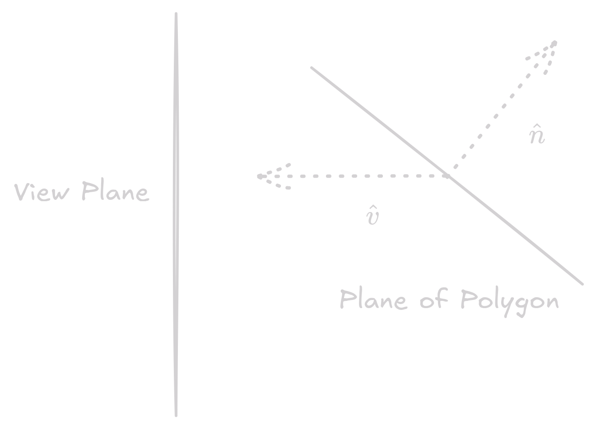
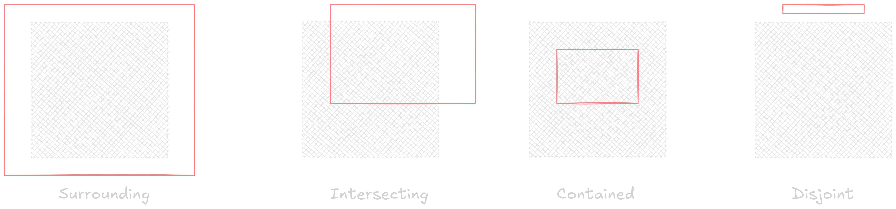
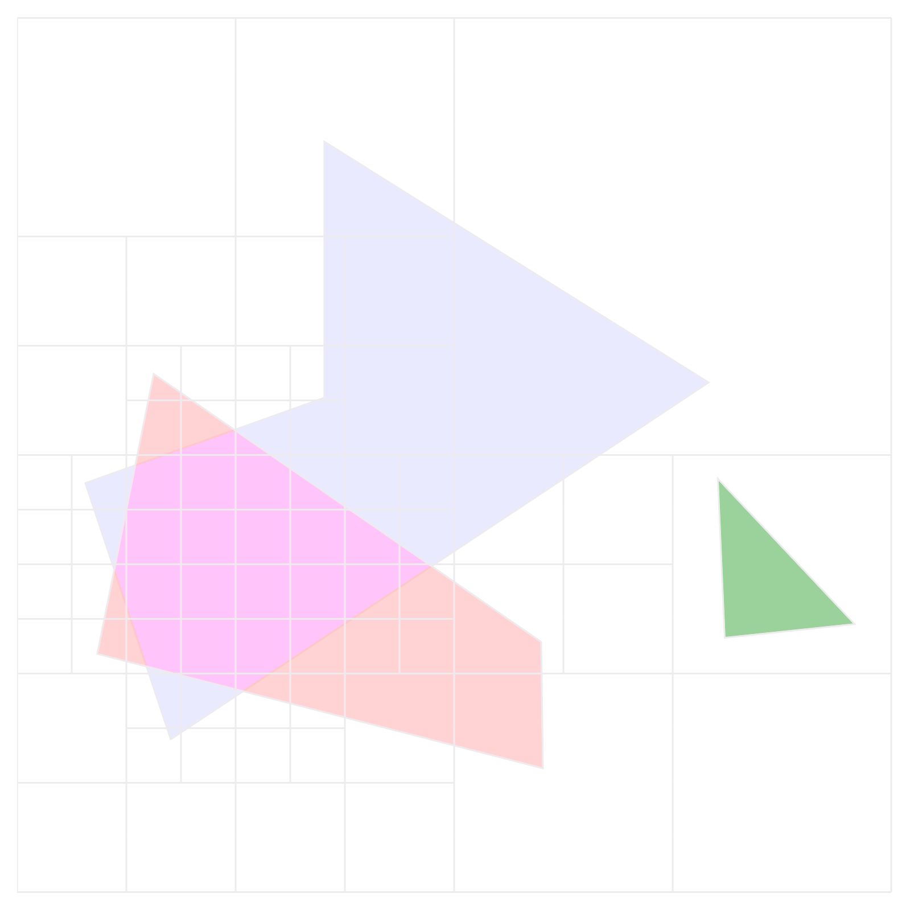
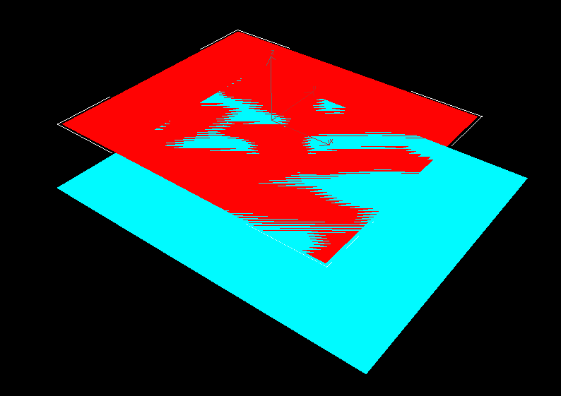
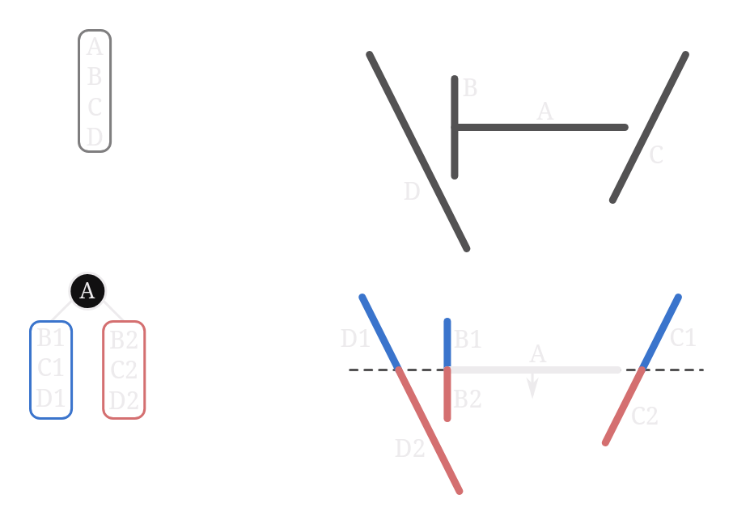

Determining the surface patches that will be be visible from a given viewpoint, also called *hidden surface removal*. There are mainly 3 techniques to do this:

1. Object precision
2. Image precision
3. List priority(hybrid object/image precision)

## Comparison of Object and Image Precision

Object precision algorithms take the basic structure as following

```python
for each object O:
    find the part A of object that is visible
    display A 
```

Image precision algorithms take the basic structure as following

```python
for each pixel P on the screen:
    Let R be the ray from viewpoint through P
    determine the visible object O pierced by R
    if there is such O:
        display the pixel in the color of O
    else:
        display the pixel in the background color
```

| Object Precision | Image Precision |
| --- | --- |
| Computes all visible parts | Determines visible parts for each pixel |
| Complexity based on number of objects | Complexity based on number of pixels |

## Back Face Culling (Object Precision)

- Discard back facing polygons from rendering
- Consider counter-clockwise orientation outward. Discard face if $\hat{v} \cdot \hat{n} < 0$
  
<figure markdown="span">
    { width=400}
    <figcaption markdown="span">Back face culling
    </figcaption>
</figure>

## Ray Casting (Image Precision)

Computes the visibility function. $R$ is a ray with origin $Q$ and direction $(P' - Q)$, where $P'$ is the pixel center. The visibility function is defined as

$$
V(P, Q) = \begin{cases}
1 & \text{if } P \text{ is the result of intersection of query on ray} R \\
0 & \text{otherwise}
\end{cases}
$$

- Partition the project plane into pixels
- For each pixel, construct a ray emanating from the eye/camera passing through the center of the pixel and into the scene
- Intersect the ray with every object in the scene
- Store the first hit object and its color

## Warnock's Algorithm (Image precision)

- Elegant divide-and-conquer hidden surface algorithm
- Relies on area coherence of polygons to resolve visibility of many polygons in image space
- Each polygon has one of the four relationships to the area of interest 

<figure markdown="span">
    { width=800}
    <figcaption markdown="span">Warnock's Algorithm Base Cases
    </figcaption>
</figure>

```python
def warnock(region):
    if all(polygons are disjoint):
        fill(background color)
    else if only one intersecting or contained polygon:
        fill(background color)
        scan convert the polygon
    else if any(surrounding polygon):
        fill(polygons color)
    else:
        divide the area into 4 quadrants
        for each quadrant:
            warnock(quadrant)
```

<figure markdown="span">
    { width=400}
    <figcaption markdown="span">Warnock's Quad Tree
    </figcaption>
</figure>

Subdivision continues till the resolution of image is reached, and then polygons are sorted by z-values and the closest polygon is displayed.

## Z-Buffer Algorithm (Image Precision)

- Record depth information for each pixel
- Z-buffer is a 2D array of same size as the frame-buffer, which stores depth as real values
- Scan convert primitives in frame-buffer and Z-buffer

```python
Initialize FRAME_BUFFER to background color
Initialize DEPTH ti infinite
for each face:
    for each point p of F:
        if projects to FRAME_BUFFER[i, j]:
            if depth(p) < DEPTH[i, j]:
                FRAME_BUFFER[i, j] = color(p)
                DEPTH[i, j] = depth(p)
```

### Z-Buffer Precision Problems

- In practice, the z-values in the buffer are non-negative integers as it's faster to process integers over true floats
- Using an integer range of $B$ values $\{0, 1, 2, \ldots, B-1\}$
    - Map 0 to near plane and $B-1$ to far plane
    - $z, n, f > 0$ w.r.t. the camera space
- Each z-value is sent to a bucket with depth

$$\Delta z = \frac{f - n}{B}$$


If $b$ bits are used to store the z-value, then $B = 2^b$. We need enough bits to make sure any triangle in front of another triangle will have it's depth mapped to distinct depth bins. For example, in a scene where triangles have a separation of at least 1 meter, $\Delta z > 1$ will be sufficient.

Two ways to make $\Delta z$ smaller:

- Move $n, f$ closer to each other
- Increase the number of bits $b$, but this is often not possible due to hardware limitations

In case of perspective transformation, 

$$z = n + f - \frac{f \cdot n}{z_w}$$

where $z_w$ is the depth in world space, and $z$ is post-perspective transformation depth. Now, bin size vary with depth 

$$\Delta z_w \approx \frac{z_w^2 \Delta z}{fn}$$

Largest bin size is for $z_w = f$, and we cannot choose $n = 0$. To make $\Delta z_w^{\text{max}}$ as small as possible, we need to minimize $f$ and maximize $n$. This is why it's important to choose $n, f$ as close as possible to each other.

If $\Delta z_w^{\text{max}}$ is too large, then we see Z-fighting artifacts

<figure markdown="span">
    { width=400}
    <figcaption markdown="span">Z-fighting
    </figcaption>
</figure>

## Painter's Algorithm - BSP Tree Algorithm (List Priority)

- Faces in the scene are sorted by their distance from the camera, and drawn in that order
- Cannot always be used, for example incase of piercing polygons or cyclic overlaps

BSP(Binary Space Partitioning) Tree is a painter's algorithm with an added restriction that no polygon crosses the plane defined by any other polygon

### Basic Idea

- Consider two triangles $T_1$ and $T_2$
- $T_1:f_1(p) = 0$ $\forall$ $p \in T_1$ and let $f_1(p) < 0$ $\forall$ $p \in T_2$

Then for any viewpoint $e$, correct rendering is

```python
if f_1(e) < 0:
    draw T_1
    draw T_2
else:
    draw T_2
    draw T_1

```

!!! note
    To check which side of the triangle the point is on, you need to only check the corners

### Tree Construction

This observation can be generalized to many objects provided none of them span the plane defined by $T_1$

We can construct a binary tree with 

- root: $T_1$
- negative branch: objects with vertices satisfying $f_1(p) < 0$
- positive branch: objects with vertices satisfying $f_1(p) > 0$

```python
def draw(bsptree tree, point e)
    if tree.empty
        return
    if f_tree_root(e) < 0
        draw(tree.plus, e)
        rasterize(tree.triangle)
        draw(tree.minus, e)
    else
        draw(tree.minus, e)
        rasterize(tree.triangle)
        draw(tree.plus, e)
```
Once the tree is pre-computed, rendering will work for any viewpoint

!!! question "What if the polygon spans the plane?"
    - Split the polygon into two parts
    - Add the two parts to the tree
    - Continue the process recursively
    
    <figure markdown="span">
        { width=500}
        <figcaption markdown="span">BSP Tree Splitting
        </figcaption>
    </figure>